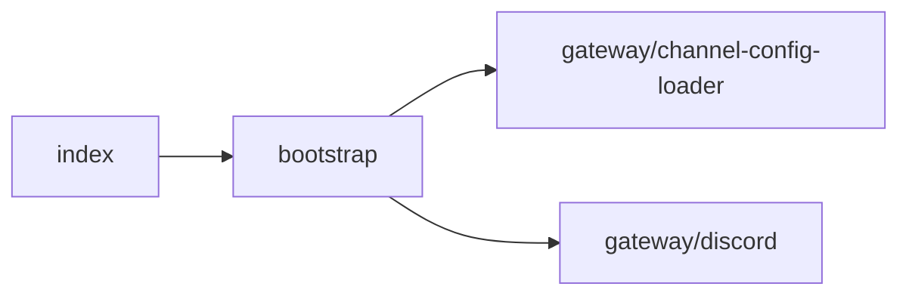

# apps/discord/ 依存関係（自動生成）

> commit 時に自動再生成。手動編集禁止。

## ファイル依存関係図

## ファイル別依存一覧

### bootstrap.ts

- モジュール内依存: gateway/channel-config-loader, gateway/discord
- 他モジュール依存: agent, application, gateway, infrastructure, ltm, observability, ollama, opencode, scheduling, shared, store, tts
- 外部依存: .bun, fs, path

### gateway/channel-config-loader.ts

- 依存なし

### gateway/discord.ts

- 他モジュール依存: infrastructure, shared
- 外部依存: .bun

### index.ts

- モジュール内依存: bootstrap
- 他モジュール依存: observability
