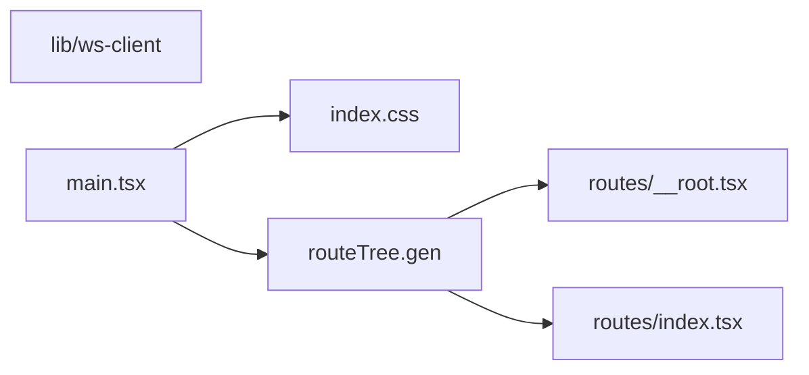

# apps/web/ 依存関係（自動生成）

> commit 時に自動再生成。手動編集禁止。

## ファイル依存関係図

## ファイル別依存一覧

### index.css.ts

- 依存なし

### lib/ws-client.ts

- 他モジュール依存: shared

### main.tsx.ts

- モジュール内依存: index.css, routeTree.gen
- 外部依存: .bun

### routeTree.gen.ts

- モジュール内依存: routes/\_\_root.tsx, routes/index.tsx

### routes/\_\_root.tsx.ts

- 外部依存: .bun

### routes/index.tsx.ts

- 外部依存: .bun
