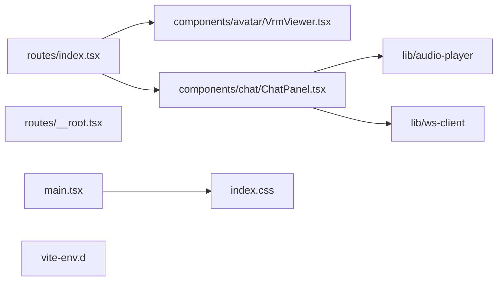

# apps/web/ 依存関係（自動生成）

> commit 時に自動再生成。手動編集禁止。

## ファイル依存関係図

## ファイル別依存一覧

### components/avatar/VrmViewer.tsx.ts

- 他モジュール依存: shared
- 外部依存: ../../../node_modules/.bun/three@0.183.2/node_modules/three/build/three.cjs, @pixiv/three-vrm, @react-three/drei, @react-three/fiber, react, three/addons/loaders/GLTFLoader.js

### components/chat/ChatPanel.tsx.ts

- モジュール内依存: lib/audio-player, lib/ws-client
- 他モジュール依存: shared
- 外部依存: react

### index.css.ts

- 依存なし

### lib/audio-player.ts

- 依存なし

### lib/ws-client.ts

- 他モジュール依存: shared

### main.tsx.ts

- モジュール内依存: index.css
- 外部依存: ./routeTree.gen, @tanstack/react-router, react, react-dom/client

### routes/\_\_root.tsx.ts

- 外部依存: @tanstack/react-router

### routes/index.tsx.ts

- モジュール内依存: components/avatar/VrmViewer.tsx, components/chat/ChatPanel.tsx
- 他モジュール依存: shared
- 外部依存: @tanstack/react-router, react

### vite-env.d.ts

- 外部依存: vite/client
