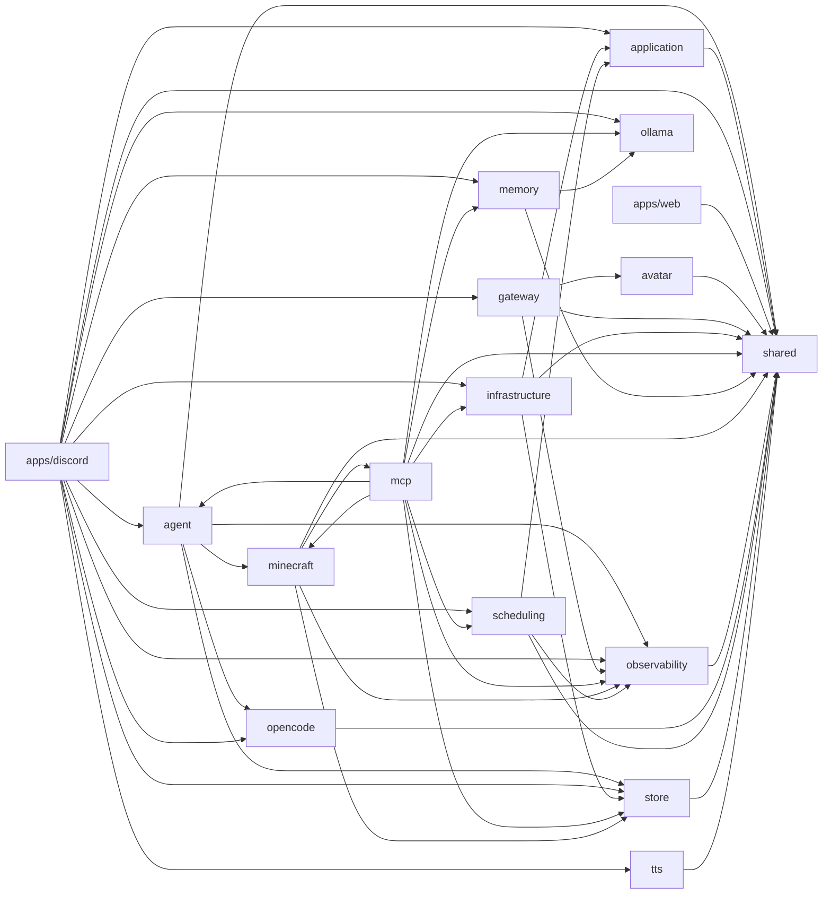

# 依存関係グラフ（自動生成）

> commit 時に自動再生成。手動編集禁止。

## モジュール依存関係図

## モジュール別依存一覧

### agent

- 内部依存: minecraft, observability, opencode, shared, store
- 外部依存: ../../../node_modules/.bun/drizzle-orm@0.45.1/node_modules/drizzle-orm/index.cjs, ../../../node_modules/.bun/zod@4.3.6/node_modules/zod/index.cjs, path
- ファイル数: 19

### application

- 内部依存: shared
- 外部依存: なし
- ファイル数: 5

### apps/discord

- 内部依存: agent, application, gateway, infrastructure, memory, observability, ollama, opencode, scheduling, shared, store, tts
- 外部依存: ../../../node_modules/.bun/@types+bun@1.3.9/node_modules/@types/bun/index.d.ts, ../../../node_modules/.bun/discord.js@14.25.1/node_modules/discord.js/src/index.js, ../../../node_modules/.bun/zod@4.3.6/node_modules/zod/index.cjs, fs, path
- ファイル数: 5

### apps/web

- 内部依存: shared
- 外部依存: ../../../node_modules/.bun/three@0.183.2/node_modules/three/build/three.cjs, ./routeTree.gen, @pixiv/three-vrm, @react-three/drei, @react-three/fiber, @tanstack/react-router, react, react-dom/client, three/addons/loaders/GLTFLoader.js, vite/client
- ファイル数: 9

### avatar

- 内部依存: shared
- 外部依存: なし
- ファイル数: 3

### gateway

- 内部依存: avatar, observability, shared
- 外部依存: ../../../node_modules/.bun/elysia@1.4.28/node_modules/elysia/dist/index.js
- ファイル数: 4

### infrastructure

- 内部依存: application, shared, store
- 外部依存: ../../../node_modules/.bun/discord.js@14.25.1/node_modules/discord.js/src/index.js
- ファイル数: 6

### mcp

- 内部依存: agent, infrastructure, memory, minecraft, observability, ollama, scheduling, shared, store
- 外部依存: ../../../node_modules/.bun/discord.js@14.25.1/node_modules/discord.js/src/index.js, ../../../node_modules/.bun/zod@4.3.6/node_modules/zod/index.cjs, @modelcontextprotocol/sdk/server/mcp.js, @modelcontextprotocol/sdk/server/stdio.js, @modelcontextprotocol/sdk/server/webStandardStreamableHttp.js, fs, path
- ファイル数: 15

### memory

- 内部依存: ollama, shared
- 外部依存: bun:sqlite, fs, path
- ファイル数: 31

### minecraft

- 内部依存: mcp, observability, shared, store
- 外部依存: ../../../node_modules/.bun/mineflayer-pathfinder@2.4.5/node_modules/mineflayer-pathfinder/index.js, ../../../node_modules/.bun/mineflayer@4.35.0/node_modules/mineflayer/index.js, ../../../node_modules/.bun/prismarine-viewer@1.33.0/node_modules/prismarine-viewer/index.js, ../../../node_modules/.bun/zod@4.3.6/node_modules/zod/index.cjs, @modelcontextprotocol/sdk/server/mcp.js, @modelcontextprotocol/sdk/server/stdio.js, path, prismarine-entity, prismarine-recipe, vec3
- ファイル数: 26

### observability

- 内部依存: shared
- 外部依存: なし
- ファイル数: 4

### ollama

- 内部依存: なし
- 外部依存: なし
- ファイル数: 4

### opencode

- 内部依存: shared
- 外部依存: @opencode-ai/sdk/v2
- ファイル数: 6

### scheduling

- 内部依存: application, observability, shared
- 外部依存: ../../../node_modules/.bun/zod@4.3.6/node_modules/zod/index.cjs, fs, path
- ファイル数: 7

### shared

- 内部依存: なし
- 外部依存: ../../../node_modules/.bun/zod@4.3.6/node_modules/zod/index.cjs, path
- ファイル数: 14

### store

- 内部依存: shared
- 外部依存: ../../../node_modules/.bun/drizzle-orm@0.45.1/node_modules/drizzle-orm/bun-sqlite/index.js, ../../../node_modules/.bun/drizzle-orm@0.45.1/node_modules/drizzle-orm/index.cjs, ../../../node_modules/.bun/drizzle-orm@0.45.1/node_modules/drizzle-orm/sqlite-core/index.js, bun:sqlite, fs, path
- ファイル数: 13

### tts

- 内部依存: shared
- 外部依存: なし
- ファイル数: 4
