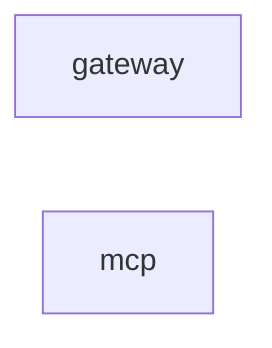

# 依存関係グラフ（自動生成）

> commit 時に自動再生成。手動編集禁止。

## モジュール依存関係図

## モジュール別依存一覧

### gateway/

- 内部依存: なし
- 外部依存: .bun, @vicissitude/infrastructure/discord/attachment-mapper, @vicissitude/infrastructure/discord/url-rewriter, @vicissitude/shared/types
- ファイル数: 2

### mcp/

- 内部依存: なし
- 外部依存: .bun, @modelcontextprotocol/sdk/server/mcp.js, @modelcontextprotocol/sdk/server/stdio.js, @modelcontextprotocol/sdk/server/webStandardStreamableHttp.js, @vicissitude/infrastructure/discord/attachment-mapper, @vicissitude/ltm/episodic, @vicissitude/ltm/llm-port, @vicissitude/ltm/ltm-storage, @vicissitude/ltm/retrieval, @vicissitude/ltm/semantic-fact, @vicissitude/ltm/semantic-memory, @vicissitude/ollama, @vicissitude/shared/config, @vicissitude/shared/constants, @vicissitude/shared/functions, @vicissitude/shared/types, @vicissitude/store/db, @vicissitude/store/mc-bridge, @vicissitude/store/queries, fs, path, prismarine-entity, prismarine-recipe, vec3
- ファイル数: 34
