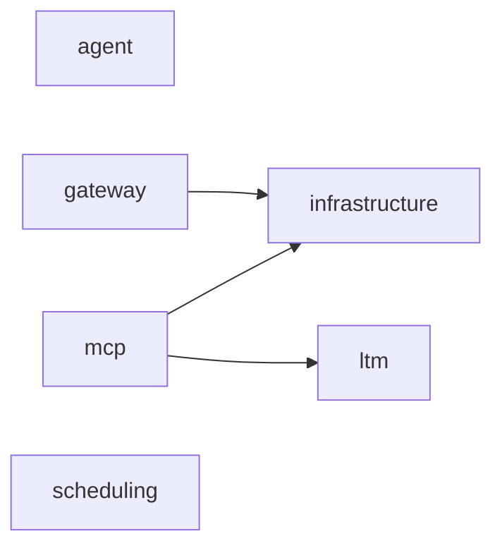

# 依存関係グラフ（自動生成）

> commit 時に自動再生成。手動編集禁止。

## モジュール依存関係図

## モジュール別依存一覧

### agent/

- 内部依存: なし
- 外部依存: ../../opencode/session-adapter.ts, ../../store/db.ts, ../../store/event-buffer.ts, ../../store/mc-bridge.ts, ../../store/queries.ts, .bun, @vicissitude/shared/constants, @vicissitude/shared/functions, @vicissitude/shared/types, @vicissitude/store/db, @vicissitude/store/queries, @vicissitude/store/schema, path
- ファイル数: 12

### gateway/

- 内部依存: infrastructure/
- 外部依存: .bun, @vicissitude/shared/types
- ファイル数: 2

### infrastructure/

- 内部依存: なし
- 外部依存: ../../application/message-ingestion-service.ts, ../../store/db.ts, ../../store/queries.ts, .bun, @vicissitude/shared/types
- ファイル数: 3

### ltm/

- 内部依存: なし
- 外部依存: @vicissitude/ollama, @vicissitude/shared/types, bun:sqlite, fs, path
- ファイル数: 21

### mcp/

- 内部依存: infrastructure/, ltm/
- 外部依存: ../../store/db.ts, ../../store/mc-bridge.ts, ../../store/queries.ts, .bun, @modelcontextprotocol/sdk/server/mcp.js, @modelcontextprotocol/sdk/server/stdio.js, @modelcontextprotocol/sdk/server/webStandardStreamableHttp.js, @vicissitude/ollama, @vicissitude/shared/config, @vicissitude/shared/constants, @vicissitude/shared/functions, @vicissitude/shared/types, @vicissitude/store/db, fs, path, prismarine-entity, prismarine-recipe, vec3
- ファイル数: 34

### scheduling/

- 内部依存: なし
- 外部依存: .bun, @vicissitude/application/heartbeat-service, @vicissitude/observability/metrics, @vicissitude/shared/config, @vicissitude/shared/functions, @vicissitude/shared/types, fs, path
- ファイル数: 3
