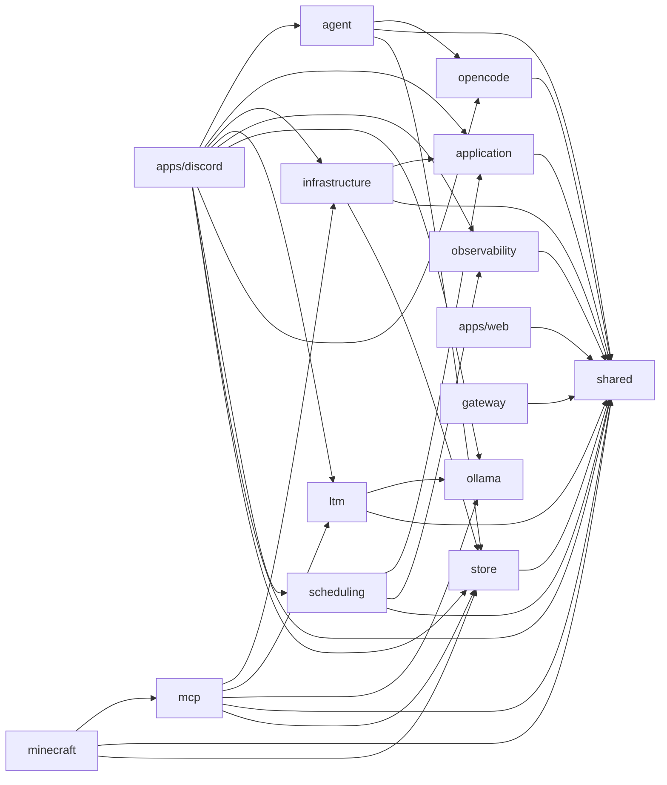

# 依存関係グラフ（自動生成）

> commit 時に自動再生成。手動編集禁止。

## モジュール依存関係図

## モジュール別依存一覧

### agent

- 内部依存: opencode, shared, store
- 外部依存: .bun, path
- ファイル数: 17

### application

- 内部依存: shared
- 外部依存: なし
- ファイル数: 4

### apps/discord

- 内部依存: agent, application, infrastructure, ltm, observability, ollama, opencode, scheduling, shared, store
- 外部依存: .bun, fs, path
- ファイル数: 4

### apps/web

- 内部依存: shared
- 外部依存: .bun
- ファイル数: 6

### gateway

- 内部依存: shared
- 外部依存: .bun
- ファイル数: 2

### infrastructure

- 内部依存: application, shared, store
- 外部依存: .bun
- ファイル数: 6

### ltm

- 内部依存: ollama, shared
- 外部依存: bun:sqlite, fs, path
- ファイル数: 31

### mcp

- 内部依存: infrastructure, ltm, ollama, shared, store
- 外部依存: .bun, @modelcontextprotocol/sdk/server/mcp.js, @modelcontextprotocol/sdk/server/stdio.js, @modelcontextprotocol/sdk/server/webStandardStreamableHttp.js, fs, path
- ファイル数: 15

### minecraft

- 内部依存: mcp, shared, store
- 外部依存: .bun, @modelcontextprotocol/sdk/server/mcp.js, @modelcontextprotocol/sdk/server/stdio.js, path
- ファイル数: 22

### observability

- 内部依存: shared
- 外部依存: なし
- ファイル数: 4

### ollama

- 内部依存: なし
- 外部依存: なし
- ファイル数: 2

### opencode

- 内部依存: shared
- 外部依存: @opencode-ai/sdk/v2
- ファイル数: 4

### scheduling

- 内部依存: application, observability, shared
- 外部依存: .bun, fs, path
- ファイル数: 5

### shared

- 内部依存: なし
- 外部依存: .bun, path
- ファイル数: 14

### store

- 内部依存: shared
- 外部依存: .bun, bun:sqlite, fs, path
- ファイル数: 13
