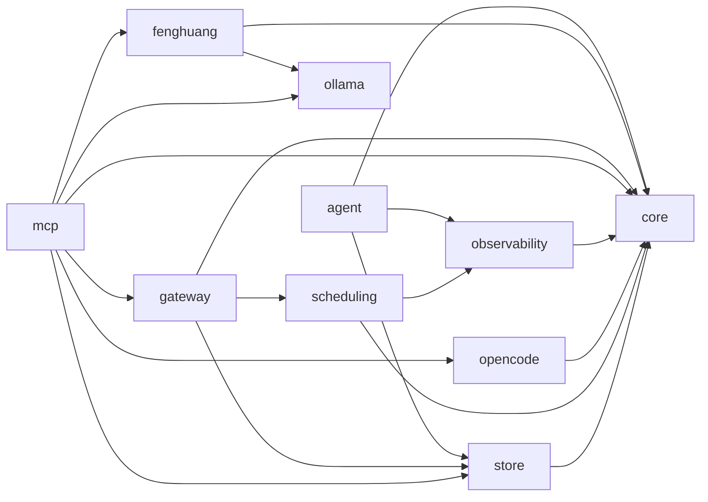

# 依存関係グラフ（自動生成）

> commit 時に自動再生成。手動編集禁止。

## モジュール依存関係図

## モジュール別依存一覧

### agent/

- 内部依存: core/, observability/, store/
- 外部依存: drizzle-orm, path
- ファイル数: 10

### core/

- 内部依存: なし
- 外部依存: path, zod
- ファイル数: 4

### fenghuang/

- 内部依存: core/, ollama/
- 外部依存: fenghuang, fs, path
- ファイル数: 4

### gateway/

- 内部依存: core/, scheduling/, store/
- 外部依存: discord.js
- ファイル数: 5

### mcp/

- 内部依存: core/, fenghuang/, gateway/, ollama/, opencode/, store/
- 外部依存: @modelcontextprotocol/sdk/server/mcp.js, @modelcontextprotocol/sdk/server/stdio.js, @modelcontextprotocol/sdk/server/webStandardStreamableHttp.js, discord.js, fenghuang, fs, mineflayer, mineflayer-pathfinder, path, prismarine-entity, prismarine-recipe, prismarine-viewer, vec3, zod
- ファイル数: 30

### observability/

- 内部依存: core/
- 外部依存: なし
- ファイル数: 2

### ollama/

- 内部依存: なし
- 外部依存: なし
- ファイル数: 1

### opencode/

- 内部依存: core/
- 外部依存: @opencode-ai/sdk/v2
- ファイル数: 2

### scheduling/

- 内部依存: core/, observability/
- 外部依存: fs, path, zod
- ファイル数: 3

### store/

- 内部依存: core/
- 外部依存: bun:sqlite, drizzle-orm, fs, path
- ファイル数: 7
