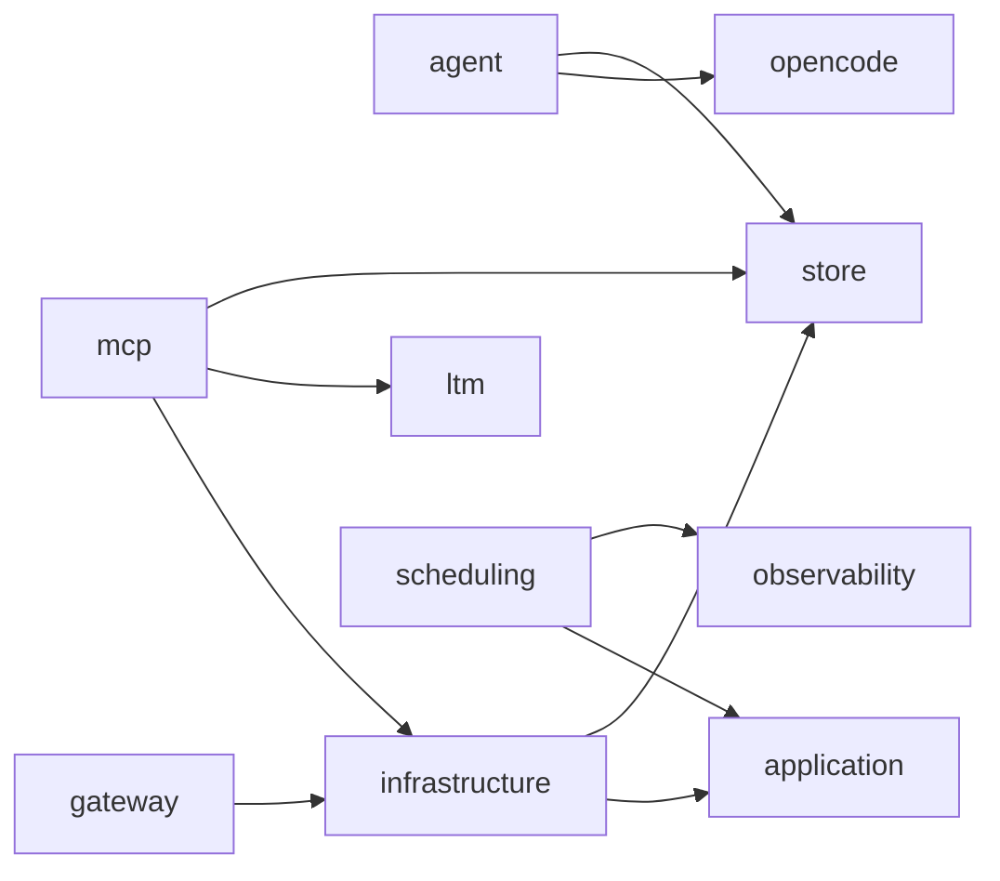

# 依存関係グラフ（自動生成）

> commit 時に自動再生成。手動編集禁止。

## モジュール依存関係図

## モジュール別依存一覧

### agent/

- 内部依存: opencode/, store/
- 外部依存: .bun, @vicissitude/shared/constants, @vicissitude/shared/functions, @vicissitude/shared/types, path
- ファイル数: 12

### application/

- 内部依存: なし
- 外部依存: @vicissitude/shared/types
- ファイル数: 2

### gateway/

- 内部依存: infrastructure/
- 外部依存: .bun, @vicissitude/shared/types
- ファイル数: 2

### infrastructure/

- 内部依存: application/, store/
- 外部依存: .bun, @vicissitude/shared/types
- ファイル数: 3

### ltm/

- 内部依存: なし
- 外部依存: @vicissitude/ollama, @vicissitude/shared/types, bun:sqlite, fs, path
- ファイル数: 21

### mcp/

- 内部依存: infrastructure/, ltm/, store/
- 外部依存: .bun, @modelcontextprotocol/sdk/server/mcp.js, @modelcontextprotocol/sdk/server/stdio.js, @modelcontextprotocol/sdk/server/webStandardStreamableHttp.js, @vicissitude/ollama, @vicissitude/shared/config, @vicissitude/shared/constants, @vicissitude/shared/functions, @vicissitude/shared/types, fs, path, prismarine-entity, prismarine-recipe, vec3
- ファイル数: 34

### observability/

- 内部依存: なし
- 外部依存: @vicissitude/shared/constants, @vicissitude/shared/functions, @vicissitude/shared/types
- ファイル数: 2

### opencode/

- 内部依存: なし
- 外部依存: @opencode-ai/sdk/v2, @vicissitude/shared/functions, @vicissitude/shared/types
- ファイル数: 3

### scheduling/

- 内部依存: application/, observability/
- 外部依存: .bun, @vicissitude/shared/config, @vicissitude/shared/functions, @vicissitude/shared/types, fs, path
- ファイル数: 3

### store/

- 内部依存: なし
- 外部依存: .bun, @vicissitude/shared/types, bun:sqlite, fs, path
- ファイル数: 6
