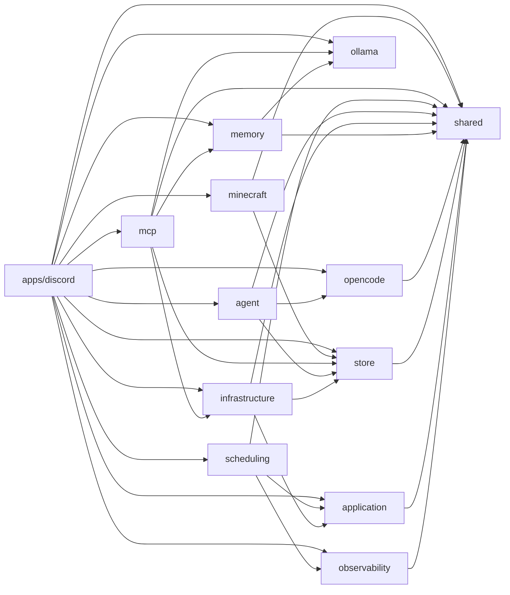

# Bun Workspaces 化 + モジュール分割 仕様

## 1. 概要

現在の単一パッケージ構成（`src/` フラットモジュール）を Bun workspaces によるモノレポに移行する。
目的は依存関係の明示化、ビルド境界の確立、各モジュールの独立テスト可能性の向上。

## 2. 設計判断

### 2.1 パッケージ構成

Plan の提案を現行の依存関係グラフに基づき修正する。

| パッケージ                | 現行モジュール                         | 根拠                                                                                                   |
| ------------------------- | -------------------------------------- | ------------------------------------------------------------------------------------------------------ |
| `packages/shared`         | `core/`                                | 型定義、定数、ユーティリティ。全パッケージの共通基盤。依存なし                                         |
| `packages/observability`  | `observability/`                       | logger, metrics。shared のみに依存。agent に含めると shared と同格の基盤が agent に埋もれる            |
| `packages/application`    | `application/`                         | HeartbeatService, MessageIngestionService。shared のみに依存する汎用サービス層                         |
| `packages/ollama`         | `ollama/`                              | OllamaEmbeddingAdapter。外部依存なし・内部依存なし。memory と mcp の両方から使われるため独立パッケージ |
| `packages/store`          | `store/`                               | DB スキーマ、クエリ、EventBuffer。shared のみに依存                                                    |
| `packages/opencode`       | `opencode/`                            | OpenCode SDK アダプタ。shared のみに依存                                                               |
| `packages/memory`         | `memory/`                              | 長期記憶。shared, ollama に依存                                                                        |
| `packages/infrastructure` | `infrastructure/`                      | Discord 固有のアダプタ + SQLite BufferedEventStore。shared, application, store に依存                  |
| `packages/agent`          | `agent/`                               | AgentRunner, Discord/Minecraft エージェント。shared, opencode, store に依存                            |
| `packages/scheduling`     | `scheduling/`                          | HeartbeatScheduler, ConsolidationScheduler。shared, application, observability に依存                  |
| `packages/mcp`            | `mcp/`（minecraft 除く）               | MCP サーバー群。shared, infrastructure, memory, ollama, store に依存                                   |
| `packages/minecraft`      | `mcp/minecraft/`                       | Minecraft 固有ロジック。重い外部依存（mineflayer 等）を分離                                            |
| `apps/discord`            | `gateway/`, `bootstrap.ts`, `index.ts` | エントリーポイント + Discord ゲートウェイ。全パッケージを組み立てる composition root                   |

### 2.2 設計判断の詳細

#### D1: パッケージ名とエクスポート戦略

**決定**: `@vicissitude/<name>` スコープ + サブパスエクスポート。

```jsonc
// packages/shared/package.json
{
	"name": "@vicissitude/shared",
	"exports": {
		"./types": "./src/types.ts",
		"./config": "./src/config.ts",
		"./constants": "./src/constants.ts",
		"./functions": "./src/functions.ts",
	},
}
```

**根拠**:

- barrel export（`"."` 単一エントリ）は tree-shaking に不利で、循環依存の温床になる。
- サブパスエクスポートにより、消費側が必要なモジュールだけを import でき、依存の意図が明確になる。
- Bun は `exports` フィールドを尊重するため、`*.ts` を直接指定可能（トランスパイル不要）。
- ただし、ファイル数が少なく全体が一つの凝集単位であるパッケージ（ollama, observability 等）は `"."` 単一エントリで十分。

#### D2: spec/ ディレクトリの配置

**決定**: ルートの `spec/` にそのまま残す。

**根拠**:

- 仕様テスト（`*.spec.ts`）は公開 API の契約を検証するブラックボックステストであり、パッケージ内部構造に依存すべきでない。
- ルートに一箇所にまとめることで、仕様テストの実行・管理が容易。
- パッケージ移行後も `spec/` の import パスを `@vicissitude/*` に書き換えるだけで対応可能。
- ユニットテスト（`*.test.ts`）は各パッケージ内に co-locate する（既存方針を維持）。

#### D3: tsconfig 戦略

**決定**: 各パッケージ独立の `tsconfig.json` + ルートの共通設定を `extends` で継承。Project References は使わない。

```jsonc
// tsconfig.base.json（ルート）
{
	"compilerOptions": {
		"lib": ["ESNext"],
		"target": "ESNext",
		"module": "Preserve",
		"moduleDetection": "force",
		"moduleResolution": "bundler",
		"allowImportingTsExtensions": true,
		"verbatimModuleSyntax": true,
		"noEmit": true,
		"strict": true,
		"skipLibCheck": true,
		"noFallthroughCasesInSwitch": true,
		"noUncheckedIndexedAccess": true,
		"noImplicitOverride": true,
	},
}
```

```jsonc
// packages/shared/tsconfig.json
{
	"extends": "../../tsconfig.base.json",
	"include": ["src"],
}
```

**根拠**:

- 現在 `tsgo`（TypeScript Go 版）を使用しており、Project References のサポートが不完全な可能性がある。
- Bun は `exports` フィールドによるパッケージ解決を行うため、Project References なしでも cross-package import が正しく解決される。
- 各パッケージの `tsconfig.json` は `include` でスコープを限定し、型チェックの対象を明確化する。
- ルートの `tsconfig.json` は `tsconfig.base.json` をリネームし、ルート固有の設定（`spec/` の include 等）は別途 `tsconfig.json` で管理する。

#### D4: infrastructure と store の統合判断

**決定**: 統合しない。`packages/infrastructure` と `packages/store` を別パッケージとして維持。

**根拠**:

- `infrastructure/` は 2 つの異なる関心を持つ:
  - `infrastructure/discord/`: Discord 固有のアダプタ（`attachment-mapper.ts`, `url-rewriter.ts`）
  - `infrastructure/store/`: `SqliteBufferedEventStore`（`application/` のポートの SQLite 実装）
- `store/` は純粋な DB アクセス層（スキーマ、クエリ、EventBuffer）で、shared のみに依存。
- `infrastructure/` は `application/`, `core/`, `store/` に依存し、Discord 固有の外部依存（`discord.js`）を持つ。
- 統合すると `store/` に不要な `discord.js` 依存が混入し、Memory や MCP など `store/` だけを使いたいパッケージが重くなる。

#### D5: ollama の配置判断

**決定**: 独立パッケージ `packages/ollama`。

**根拠**:

- `ollama/` は現在 3 箇所から使用されている:
  - `bootstrap.ts`（Memory 初期化時）
  - `memory/composite-llm-adapter.ts`
  - `mcp/core-server.ts`
- `memory` に含めると `mcp` が `memory` に依存するか、重複実装が必要になる。
- `shared` に含めると shared の「内部依存なし・外部依存最小」という性質が崩れる（HTTP fetch アダプタは shared の責務外）。
- ファイルが 1 つだけだが、独立パッケージのオーバーヘッドは `package.json` と `tsconfig.json` の 2 ファイルのみ。凝集度と依存方向の明確さを優先する。

#### D6: application と scheduling の配置判断

**決定**: `packages/application` と `packages/scheduling` をそれぞれ独立パッケージにする。agent には含めない。

**根拠**:

- `application/` は `core/` のみに依存する汎用サービス層。`agent/` に含めると不必要な結合が生じる。
- `scheduling/` は `application/`, `core/`, `observability/` に依存。`agent/` とは依存関係がなく、agent に含める論理的根拠がない。
- 両者は `bootstrap.ts`（composition root）から組み立てられるが、`agent/` とは独立したライフサイクルを持つ。
- パッケージ数は増えるが、各パッケージが小さく凝集度が高い方が、依存関係の管理と理解が容易。

#### D7: context/ と data/ の所属

**決定**: ルートに残す。パッケージには含めない。

**根拠**:

- `context/` と `data/` はランタイムデータ（人格定義、設定ファイル、DB ファイル等）であり、TypeScript コードパッケージではない。
- これらは `apps/discord` の composition root（`bootstrap.ts`）からパスとして参照され、各パッケージには設定値（`dataDir`, `contextDir`）として注入される。
- パッケージに含めると、パッケージの責務が曖昧になり、データファイルの配置ルールが複雑化する。

## 3. パッケージ間依存関係図（最終形）



### トポロジカル順（ビルド/テスト実行順）

| レベル              | パッケージ                                          |
| ------------------- | --------------------------------------------------- |
| L0（依存なし）      | `shared`, `ollama`                                  |
| L1（L0 のみに依存） | `observability`, `application`, `store`, `opencode` |
| L2                  | `memory`, `infrastructure`, `agent`, `scheduling`   |
| L3                  | `mcp`, `minecraft`                                  |
| App                 | `apps/discord`                                      |

## 4. 各パッケージの exports 設計

### `@vicissitude/shared`

```jsonc
{
	"name": "@vicissitude/shared",
	"private": true,
	"exports": {
		"./types": "./src/types.ts",
		"./config": "./src/config.ts",
		"./constants": "./src/constants.ts",
		"./functions": "./src/functions.ts",
	},
}
```

### `@vicissitude/observability`

```jsonc
{
	"name": "@vicissitude/observability",
	"private": true,
	"exports": {
		"./logger": "./src/logger.ts",
		"./metrics": "./src/metrics.ts",
	},
}
```

### `@vicissitude/application`

```jsonc
{
	"name": "@vicissitude/application",
	"private": true,
	"exports": {
		"./heartbeat-service": "./src/heartbeat-service.ts",
		"./message-ingestion-service": "./src/message-ingestion-service.ts",
	},
}
```

### `@vicissitude/ollama`

```jsonc
{
	"name": "@vicissitude/ollama",
	"private": true,
	"exports": {
		".": "./src/ollama-embedding-adapter.ts",
	},
}
```

### `@vicissitude/store`

```jsonc
{
	"name": "@vicissitude/store",
	"private": true,
	"exports": {
		"./db": "./src/db.ts",
		"./queries": "./src/queries.ts",
		"./schema": "./src/schema.ts",
		"./event-buffer": "./src/event-buffer.ts",
		"./mc-bridge": "./src/mc-bridge.ts",
		"./mc-status-provider": "./src/mc-status-provider.ts",
	},
}
```

### `@vicissitude/opencode`

```jsonc
{
	"name": "@vicissitude/opencode",
	"private": true,
	"exports": {
		"./session-adapter": "./src/session-adapter.ts",
		"./session-port": "./src/session-port.ts",
		"./stream-helpers": "./src/stream-helpers.ts",
	},
}
```

### `@vicissitude/memory`

```jsonc
{
	"name": "@vicissitude/memory",
	"private": true,
	"exports": {
		".": "./src/index.ts",
		"./composite-llm-adapter": "./src/composite-llm-adapter.ts",
		"./conversation-recorder": "./src/conversation-recorder.ts",
		"./fact-reader": "./src/fact-reader.ts",
		"./chat-adapter": "./src/chat-adapter.ts",
		"./storage": "./src/storage.ts",
		"./episodic": "./src/episodic.ts",
		"./retrieval": "./src/retrieval.ts",
		"./semantic-memory": "./src/semantic-memory.ts",
		"./semantic-fact": "./src/semantic-fact.ts",
		"./llm-port": "./src/llm-port.ts",
		"./types": "./src/types.ts",
	},
}
```

注: `memory` は内部ファイルが多く、相互参照も多い。barrel export（`"."`）を主に使い、外部パッケージからの import が必要なモジュールのみサブパスエクスポートする。実装フェーズで実際の外部参照を精査し、不要なサブパスは削除する。

### `@vicissitude/infrastructure`

```jsonc
{
	"name": "@vicissitude/infrastructure",
	"private": true,
	"exports": {
		"./discord/attachment-mapper": "./src/discord/attachment-mapper.ts",
		"./discord/url-rewriter": "./src/discord/url-rewriter.ts",
		"./store/sqlite-buffered-event-store": "./src/store/sqlite-buffered-event-store.ts",
	},
}
```

### `@vicissitude/agent`

```jsonc
{
	"name": "@vicissitude/agent",
	"private": true,
	"exports": {
		"./runner": "./src/runner.ts",
		"./session-store": "./src/session-store.ts",
		"./profile": "./src/profile.ts",
		"./mcp-config": "./src/mcp-config.ts",
		"./discord/discord-agent": "./src/discord/discord-agent.ts",
		"./discord/context-builder": "./src/discord/context-builder.ts",
		"./discord/router": "./src/discord/router.ts",
		"./minecraft/brain-manager": "./src/minecraft/brain-manager.ts",
		"./minecraft/minecraft-agent": "./src/minecraft/minecraft-agent.ts",
	},
}
```

### `@vicissitude/scheduling`

```jsonc
{
	"name": "@vicissitude/scheduling",
	"private": true,
	"exports": {
		"./heartbeat-scheduler": "./src/heartbeat-scheduler.ts",
		"./heartbeat-config": "./src/heartbeat-config.ts",
		"./consolidation-scheduler": "./src/consolidation-scheduler.ts",
	},
}
```

### `@vicissitude/mcp`

```jsonc
{
	"name": "@vicissitude/mcp",
	"private": true,
	"exports": {
		"./core-server": "./src/core-server.ts",
		"./code-exec-server": "./src/code-exec-server.ts",
		"./http-server": "./src/http-server.ts",
		"./memory-helpers": "./src/memory-helpers.ts",
		"./tools/discord": "./src/tools/discord.ts",
		"./tools/event-buffer": "./src/tools/event-buffer.ts",
		"./tools/memory": "./src/tools/memory.ts",
		"./tools/mc-bridge-discord": "./src/tools/mc-bridge-discord.ts",
		"./tools/mc-bridge-minecraft": "./src/tools/mc-bridge-minecraft.ts",
		"./tools/mc-memory": "./src/tools/mc-memory.ts",
		"./tools/memory": "./src/tools/memory.ts",
		"./tools/schedule": "./src/tools/schedule.ts",
	},
}
```

### `@vicissitude/minecraft`

```jsonc
{
	"name": "@vicissitude/minecraft",
	"private": true,
	"exports": {
		"./server": "./src/server.ts",
		"./mc-bridge-server": "./src/mc-bridge-server.ts",
		"./mcp-tools": "./src/mcp-tools.ts",
		"./bot-connection": "./src/bot-connection.ts",
		"./bot-context": "./src/bot-context.ts",
		"./bot-queries": "./src/bot-queries.ts",
		"./job-manager": "./src/job-manager.ts",
		"./state-summary": "./src/state-summary.ts",
		"./auto-notifier": "./src/auto-notifier.ts",
		"./http-server": "./src/http-server.ts",
		"./mc-metrics": "./src/mc-metrics.ts",
	},
}
```

### `@vicissitude/discord`（apps/discord）

```jsonc
{
	"name": "@vicissitude/discord",
	"private": true,
	"module": "src/index.ts",
}
```

## 5. ルート package.json（workspace 定義）

```jsonc
{
	"name": "vicissitude",
	"private": true,
	"workspaces": ["packages/*", "apps/*"],
	"scripts": {
		"start": "bun run apps/discord/src/index.ts",
		"dev": "bun --watch run apps/discord/src/index.ts",
		"check": "tsgo --noEmit",
		"lint": "oxlint",
		"lint:fix": "oxlint --fix",
		"fmt": "oxfmt .",
		"fmt:check": "oxfmt --check .",
		"test": "bun test",
		"test:spec": "bun test spec",
		"test:unit": "bun test packages apps scripts",
		"validate": "bun run fmt:check && bun run lint && bun run check",
		// deploy 系スクリプトは変更なし
	},
}
```

## 6. 依存関係の再配置

外部依存は使用するパッケージの `package.json` に移動する。

| 外部依存                               | 移動先パッケージ                        |
| -------------------------------------- | --------------------------------------- |
| `zod`                                  | `shared`, `scheduling`, `mcp`           |
| `discord.js`                           | `infrastructure`, `mcp`, `apps/discord` |
| `@opencode-ai/sdk`                     | `opencode`                              |
| `drizzle-orm`                          | `store`, `agent`                        |
| `@modelcontextprotocol/sdk`            | `mcp`, `minecraft`                      |
| `mineflayer`, `mineflayer-pathfinder`  | `minecraft`                             |
| `prismarine-viewer`, `three`, `canvas` | `minecraft`                             |

devDependencies（`@types/bun`, `oxlint`, `oxfmt`, `@typescript/native-preview`, `dependency-cruiser`）はルートに残す。

## 7. ディレクトリ構成（最終形）

```
vicissitude/
  package.json              # workspace 定義
  tsconfig.base.json        # 共通 compilerOptions
  tsconfig.json             # ルート（spec/ 等の include）
  bun.lock
  context/                  # ランタイムデータ（git 管理）
  data/                     # ランタイムデータ（gitignore）
  spec/                     # 仕様テスト（ルートに残す）
    agent/
    application/
    ...
  packages/
    shared/
      package.json
      tsconfig.json
      src/
        types.ts
        config.ts
        constants.ts
        functions.ts
    observability/
      package.json
      tsconfig.json
      src/
        logger.ts
        logger.test.ts
        metrics.ts
    application/
      package.json
      tsconfig.json
      src/
        heartbeat-service.ts
        message-ingestion-service.ts
    ollama/
      package.json
      tsconfig.json
      src/
        ollama-embedding-adapter.ts
    store/
      package.json
      tsconfig.json
      src/
        db.ts
        queries.ts
        schema.ts
        event-buffer.ts
        event-buffer.test.ts
        mc-bridge.ts
        mc-bridge.test.ts
        mc-status-provider.ts
        test-helpers.ts
    opencode/
      package.json
      tsconfig.json
      src/
        session-adapter.ts
        session-adapter.test.ts
        session-port.ts
        stream-helpers.ts
    ltm/
      package.json
      tsconfig.json
      src/
        ...（現行 src/memory/ の全ファイル）
    infrastructure/
      package.json
      tsconfig.json
      src/
        discord/
          attachment-mapper.ts
          url-rewriter.ts
          url-rewriter.test.ts
        store/
          sqlite-buffered-event-store.ts
    agent/
      package.json
      tsconfig.json
      src/
        runner.ts
        runner.test.ts
        session-store.ts
        profile.ts
        mcp-config.ts
        discord/
          context-builder.ts
          discord-agent.ts
          profile.ts
          router.ts
        minecraft/
          brain-manager.ts
          brain-manager.test.ts
          context-builder.ts
          minecraft-agent.ts
          profile.ts
    scheduling/
      package.json
      tsconfig.json
      src/
        heartbeat-scheduler.ts
        heartbeat-scheduler.test.ts
        heartbeat-config.ts
        consolidation-scheduler.ts
    mcp/
      package.json
      tsconfig.json
      src/
        core-server.ts
        code-exec-server.ts
        http-server.ts
        memory-helpers.ts
        test-helpers.ts
        tools/
          discord.ts
          event-buffer.ts
          memory.ts
          mc-bridge-discord.ts
          mc-bridge-minecraft.ts
          mc-memory.ts
          memory.ts
          schedule.ts
    minecraft/
      package.json
      tsconfig.json
      src/
        server.ts
        mc-bridge-server.ts
        mcp-tools.ts
        bot-connection.ts
        bot-context.ts
        bot-queries.ts
        bot-queries.test.ts
        job-manager.ts
        job-manager.cooldown.test.ts
        job-manager.stuck.test.ts
        state-summary.ts
        auto-notifier.ts
        http-server.ts
        mc-metrics.ts
        helpers.ts
        actions/
          index.ts
          combat.ts
          interaction.ts
          jobs.ts
          movement.ts
          shared.ts
          survival/
            index.ts
            escape.ts
            food.ts
            shelter.ts
  apps/
    discord/
      package.json
      tsconfig.json
      src/
        bootstrap.ts
        bootstrap.test.ts
        index.ts
        gateway/
          channel-config-loader.ts
          discord.ts
```

## 8. 移行手順（実行ステップ概要）

### 移行方式: Big Bang（1 ブランチ完結）

段階的マージ（ステップごとに main にマージ）は**不可能**。理由:

- Step 1 で `core/` を移動した瞬間に 30+ ファイルの import が壊れ、main が壊れる
- `compose.yaml` の builder が `src/index.ts` を前提としており、移行完了まで deploy 不可
- spec テストの相対パスが全壊する

したがって、**1 ブランチで全ステップを完了し、最後にまとめてマージする**。移行中はデプロイ凍結（main からの deploy は可能だが、移行ブランチからは不可）。

### ステップ

1. **Step 0（準備・先行検証）**: `tsconfig.base.json` を作成、ルート `package.json` に `workspaces` を追加。**先行検証**: `tsgo` が workspace の `exports` 解決に対応しているか確認。非対応の場合は `paths` マッピングで回避策を用意。
2. **Step 1（shared）**: `packages/shared/` を作成し `src/core/` のファイルを移動。import パスを更新。**検証**: cross-package import が `bun test` と `tsgo` の両方で動くことを確認。
3. **Step 2（L0 残り）**: `packages/ollama/` を作成
4. **Step 3（L1）**: `packages/observability/`, `packages/application/`, `packages/store/`, `packages/opencode/` を作成
5. **Step 4（L2）**: `packages/memory/`, `packages/infrastructure/`, `packages/agent/`, `packages/scheduling/` を作成
6. **Step 5（L3）**: `packages/mcp/`, `packages/minecraft/` を作成
7. **Step 6（App）**: `apps/discord/` を作成し、`bootstrap.ts`, `index.ts`, `gateway/` を移動
8. **Step 7（テスト）**: `spec/` の import パスを `@vicissitude/*` に更新、テストヘルパーの移行（後述）、全テスト実行
9. **Step 8（ツーリング）**: `dependency-cruiser` 設定、`DEPS.md` 生成スクリプト、`.oxlintrc.json` のパスパターン更新
10. **Step 9（デプロイ設定）**: `compose.yaml`、Containerfile のパス更新（後述）
11. **Step 10（クリーンアップ）**: 旧 `src/` ディレクトリの削除、CI 設定の確認

各ステップ完了後にブランチ内で `bun install && nr validate && nr test` を実行して壊れていないことを確認する（全ステップ通過後にマージ）。

## 9. ランタイムパス解決

### 問題

以下の 6 箇所で `import.meta.dirname` を基準にした相対パスで `context/` や `data/` にアクセスしている。パッケージ移動によりディレクトリ階層が変わると壊れる。

| ファイル                                   | 現在の解決方法                                               |
| ------------------------------------------ | ------------------------------------------------------------ |
| `src/bootstrap.ts:376`                     | `process.env.APP_ROOT ?? resolve(import.meta.dirname, "..")` |
| `src/core/config.ts:76`                    | 同上                                                         |
| `src/agent/mcp-config.ts:8`                | 同上                                                         |
| `src/mcp/memory-helpers.ts:6`              | 同上                                                         |
| `src/mcp/tools/schedule.ts:15`             | 同上                                                         |
| `src/mcp/minecraft/mc-bridge-server.ts:12` | 同上                                                         |

### 対策

APP_ROOT 解決ロジックを `@vicissitude/shared/config` に集約する。

```typescript
// packages/shared/src/config.ts
import { resolve } from "node:path";

// APP_ROOT は apps/discord の index.ts で設定するか、環境変数で指定
export const APP_ROOT = process.env.APP_ROOT ?? resolve(process.cwd());
```

- ローカル開発時: プロジェクトルートで `bun run` するため `process.cwd()` で解決
- コンテナ内: `APP_ROOT` 環境変数で明示指定（compose.yaml で設定済み）
- `import.meta.dirname` からの相対パス（`..`, `../..`）は使わない

各パッケージは `APP_ROOT` を import して `resolve(APP_ROOT, "context", ...)` のように使用する。

## 10. テストヘルパーの移行

### 現在のヘルパー

| ファイル                      | import 元              | 移行先                                                                    |
| ----------------------------- | ---------------------- | ------------------------------------------------------------------------- |
| `spec/test-helpers.ts`        | `../src/core/types.ts` | `spec/test-helpers.ts`（import を `@vicissitude/shared/types` に変更）    |
| `spec/memory/test-helpers.ts` | `../../src/memory/*`   | `spec/memory/test-helpers.ts`（import を `@vicissitude/memory/*` に変更） |
| `src/store/test-helpers.ts`   | `bun:sqlite`           | `packages/store/src/test-helpers.ts`（パッケージ内移動）                  |
| `src/mcp/test-helpers.ts`     | `./http-server.ts` 等  | `packages/mcp/src/test-helpers.ts`（パッケージ内移動）                    |

### 方針

- spec/ 配下のヘルパーは spec/ に残し、import パスだけ `@vicissitude/*` に書き換え
- src/ 配下のヘルパーはパッケージと一緒に移動（co-locate 維持）

## 11. デプロイ設定の更新

### compose.yaml

#### builder ステージ

現在のビルドコマンド 5 箇所のパスを更新:

| 現在                                    | 移行後                                       |
| --------------------------------------- | -------------------------------------------- |
| `src/index.ts`                          | `apps/discord/src/index.ts`                  |
| `src/mcp/core-server.ts`                | `packages/mcp/src/core-server.ts`            |
| `src/mcp/code-exec-server.ts`           | `packages/mcp/src/code-exec-server.ts`       |
| `src/mcp/minecraft/server.ts`           | `packages/minecraft/src/server.ts`           |
| `src/mcp/minecraft/mc-bridge-server.ts` | `packages/minecraft/src/mc-bridge-server.ts` |

#### volumes マッピング

現在の `./src:/app/src:ro` を以下に変更:

```yaml
volumes:
  - ./packages:/app/packages:ro
  - ./apps:/app/apps:ro
  - ./context:/app/context:ro
  # data/ は既存のまま
```

#### installer ステージ

現在は `package.json` と `bun.lock` のみマウント。workspaces 化後は各パッケージの `package.json` もマウントが必要:

```yaml
volumes:
  - ./package.json:/app/package.json:ro
  - ./bun.lock:/app/bun.lock:ro
  - ./packages:/app/packages:ro # 各パッケージの package.json を含む
  - ./apps:/app/apps:ro # apps の package.json を含む
```

### pre-commit フック

- `deps:graph` スクリプトは `depcruise src` → `depcruise packages/*/src apps/*/src` に変更
- `.dependency-cruiser.mjs` の `from.path` / `to.path` パターンを全面書き換え
- 移行ブランチでは pre-commit フックが一時的に壊れるため、**フック修正を Step 8（ツーリング）に含める**

## 12. 受け入れ条件

本 Phase はアーキテクチャ移行であり、API の振る舞い変更はない。以下を受け入れ条件とする。

1. **全既存テストがパスすること**: `nr test`（spec + unit）が移行前と同一のテスト結果を返す
2. **型チェックがパスすること**: `nr check`（tsgo --noEmit）がエラーなしで完了する
3. **lint/fmt がパスすること**: `nr validate` がエラーなしで完了する
4. **パッケージ間の依存方向が仕様通りであること**: 依存関係グラフ（Section 3）に違反する import がないこと
5. **Bun workspaces の解決が正しく動作すること**: `bun install` でワークスペース間リンクが正しく張られること
6. **デプロイが動作すること**: `nr deploy` でコンテナが正常に起動すること（`Cipher` ホスト上で検証）
7. **ランタイムパス解決が正しいこと**: `context/` と `data/` へのアクセスがローカル/コンテナ両方で動作すること

## 13. リスクと緩和策

| リスク                                               | 深刻度 | 影響                          | 緩和策                                                                                        |
| ---------------------------------------------------- | ------ | ----------------------------- | --------------------------------------------------------------------------------------------- |
| `tsgo` が workspace の `exports` 解決に未対応        | 高     | 型チェックが壊れる            | Step 0 で `tsgo` の動作を先行検証。非対応の場合は `paths` マッピングで回避                    |
| `bun test` が workspace 跨ぎの import を解決できない | 高     | テスト実行失敗                | Step 1 完了時点で cross-package import のテストを実行して早期検出                             |
| spec テストの相対パス全壊                            | 高     | 48 ファイルの import が壊れる | Step 7 で `@vicissitude/*` への一括書き換え。全 spec を `bun test spec` で一括検証            |
| compose.yaml / builder 全壊                          | 高     | デプロイ不可                  | Step 9 でエントリポイントパス・volumes マッピング・installer を一括更新。移行中はデプロイ凍結 |
| `import.meta.dirname` の解決先変更                   | 中     | ランタイムパスの不整合        | Section 9 の方針で `APP_ROOT` を `shared/config` に集約し、相対パスを排除                     |
| depcruise / pre-commit フックの破損                  | 中     | commit 時にフックが失敗       | Step 8 でツーリングを更新。移行中の一時的な失敗は PR マージ時のバリデーションで補完           |
| Bun workspaces の hoisting による依存解決の違い      | 中     | 意図しないパッケージが見える  | 各パッケージの `package.json` に明示的に依存を記述し、暗黙の hoisting に頼らない              |
| 移行中の長期ブランチと main の乖離                   | 低     | コンフリクト                  | 移行中は main への大きな機能追加を控え、必要なら定期的に rebase                               |
