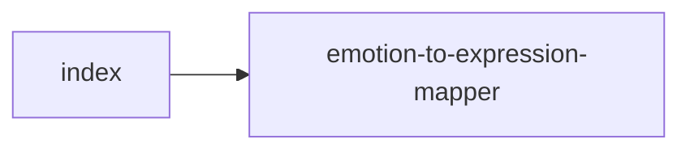

# avatar/ 依存関係（自動生成）

> commit 時に自動再生成。手動編集禁止。

## ファイル依存関係図

```mermaid
graph LR
  emotion_to_expression_mapper["emotion-to-expression-mapper"]
  index --> emotion_to_expression_mapper["emotion-to-expression-mapper"]
```

## ファイル別依存一覧

### emotion-to-expression-mapper.ts

- 他モジュール依存: shared

### index.ts

- モジュール内依存: emotion-to-expression-mapper
