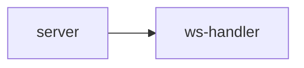

# gateway/ 依存関係（自動生成）

> commit 時に自動再生成。手動編集禁止。

## ファイル依存関係図

## ファイル別依存一覧

### server.ts

- モジュール内依存: ws-handler
- 外部依存: ../../../node_modules/.bun/elysia@1.4.28/node_modules/elysia/dist/index.js

### ws-handler.ts

- 他モジュール依存: avatar, observability, shared
