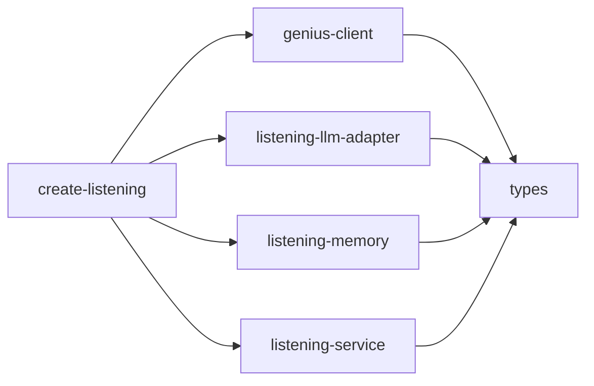

# listening/ 依存関係（自動生成）

> commit 時に自動再生成。手動編集禁止。

## ファイル依存関係図

## ファイル別依存一覧

### create-listening.ts

- モジュール内依存: genius-client, listening-llm-adapter, listening-memory, listening-service
- 他モジュール依存: memory

### genius-client.ts

- モジュール内依存: types
- 他モジュール依存: spotify

### listening-llm-adapter.ts

- モジュール内依存: types
- 他モジュール依存: memory

### listening-memory.ts

- モジュール内依存: types
- 他モジュール依存: memory, shared

### listening-service.ts

- モジュール内依存: types
- 他モジュール依存: spotify

### types.ts

- 他モジュール依存: memory, spotify
