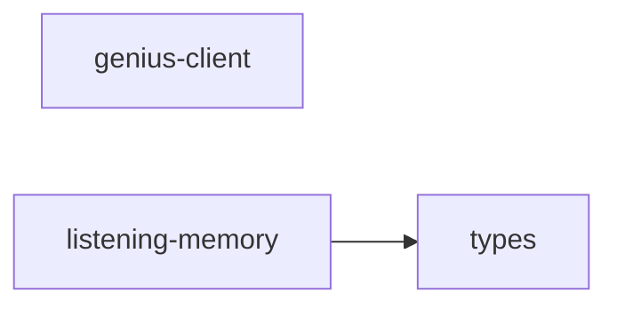

# listening/ 依存関係（自動生成）

> commit 時に自動再生成。手動編集禁止。

## ファイル依存関係図

## ファイル別依存一覧

### genius-client.ts

- 依存なし

### listening-memory.ts

- モジュール内依存: types
- 他モジュール依存: memory, shared

### types.ts

- 他モジュール依存: memory, spotify
