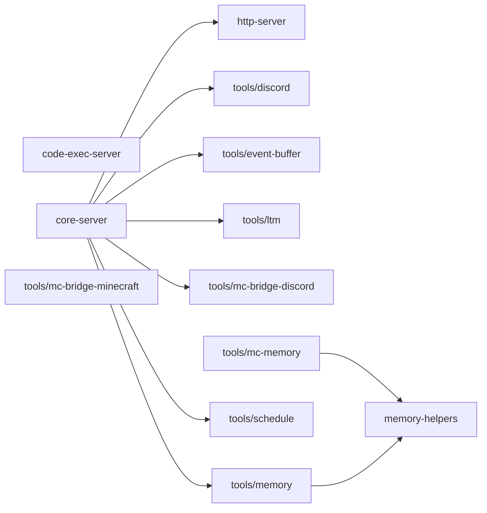

# mcp/ 依存関係（自動生成）

> commit 時に自動再生成。手動編集禁止。

## ファイル依存関係図

## ファイル別依存一覧

### code-exec-server.ts

- 外部依存: .bun, @modelcontextprotocol/sdk/server/mcp.js, @modelcontextprotocol/sdk/server/stdio.js

### core-server.ts

- モジュール内依存: http-server, tools/discord, tools/event-buffer, tools/ltm, tools/mc-bridge-discord, tools/memory, tools/schedule
- 他モジュール依存: ltm, ollama, store
- 外部依存: .bun, @modelcontextprotocol/sdk/server/mcp.js, fs, path

### http-server.ts

- 外部依存: @modelcontextprotocol/sdk/server/mcp.js, @modelcontextprotocol/sdk/server/webStandardStreamableHttp.js

### memory-helpers.ts

- 他モジュール依存: shared
- 外部依存: .bun, fs, path

### tools/discord.ts

- 他モジュール依存: infrastructure
- 外部依存: .bun, @modelcontextprotocol/sdk/server/mcp.js, fs, path

### tools/event-buffer.ts

- 他モジュール依存: store
- 外部依存: .bun, @modelcontextprotocol/sdk/server/mcp.js

### tools/ltm.ts

- 他モジュール依存: ltm
- 外部依存: .bun, @modelcontextprotocol/sdk/server/mcp.js

### tools/mc-bridge-discord.ts

- 他モジュール依存: shared, store
- 外部依存: .bun, @modelcontextprotocol/sdk/server/mcp.js

### tools/mc-bridge-minecraft.ts

- 他モジュール依存: store
- 外部依存: .bun, @modelcontextprotocol/sdk/server/mcp.js

### tools/mc-memory.ts

- モジュール内依存: memory-helpers
- 外部依存: .bun, @modelcontextprotocol/sdk/server/mcp.js, fs, path

### tools/memory.ts

- モジュール内依存: memory-helpers
- 外部依存: .bun, @modelcontextprotocol/sdk/server/mcp.js, fs, path

### tools/schedule.ts

- 他モジュール依存: shared
- 外部依存: .bun, @modelcontextprotocol/sdk/server/mcp.js, fs, path
