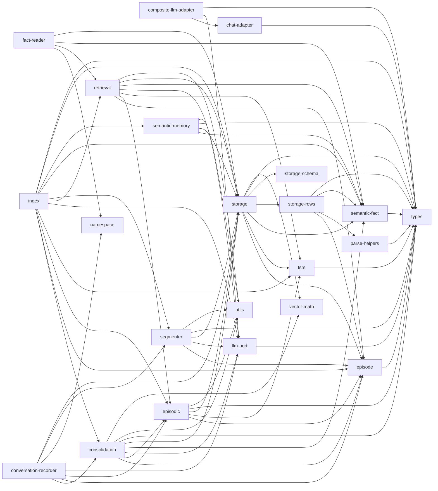

# memory/ 依存関係（自動生成）

> commit 時に自動再生成。手動編集禁止。

## ファイル依存関係図

## ファイル別依存一覧

### chat-adapter.ts

- モジュール内依存: types
- 他モジュール依存: shared

### composite-llm-adapter.ts

- モジュール内依存: chat-adapter, llm-port, types
- 他モジュール依存: ollama

### consolidation.ts

- モジュール内依存: episode, episodic, llm-port, semantic-fact, storage, types, utils, vector-math

### conversation-recorder.ts

- モジュール内依存: consolidation, episode, episodic, llm-port, namespace, segmenter, storage
- 他モジュール依存: shared
- 外部依存: fs, path

### episode.ts

- モジュール内依存: types

### episodic.ts

- モジュール内依存: episode, fsrs, storage, types, utils

### fact-reader.ts

- モジュール内依存: namespace, retrieval, semantic-fact, storage
- 他モジュール依存: shared
- 外部依存: fs

### fsrs.ts

- モジュール内依存: types

### index.ts

- モジュール内依存: consolidation, episode, episodic, fsrs, llm-port, retrieval, segmenter, semantic-fact, semantic-memory, storage, types

### llm-port.ts

- モジュール内依存: types

### namespace.ts

- 他モジュール依存: shared

### parse-helpers.ts

- モジュール内依存: types

### retrieval.ts

- モジュール内依存: episode, episodic, fsrs, llm-port, semantic-fact, storage, utils

### segmenter.ts

- モジュール内依存: episode, llm-port, storage, types, utils

### semantic-fact.ts

- モジュール内依存: types

### semantic-memory.ts

- モジュール内依存: semantic-fact, storage, types, utils

### storage.ts

- モジュール内依存: episode, fsrs, semantic-fact, storage-rows, storage-schema, types, vector-math
- 外部依存: bun:sqlite

### storage-rows.ts

- モジュール内依存: episode, parse-helpers, semantic-fact, types

### storage-schema.ts

- 外部依存: bun:sqlite

### types.ts

- 依存なし

### utils.ts

- 依存なし

### vector-math.ts

- 依存なし
