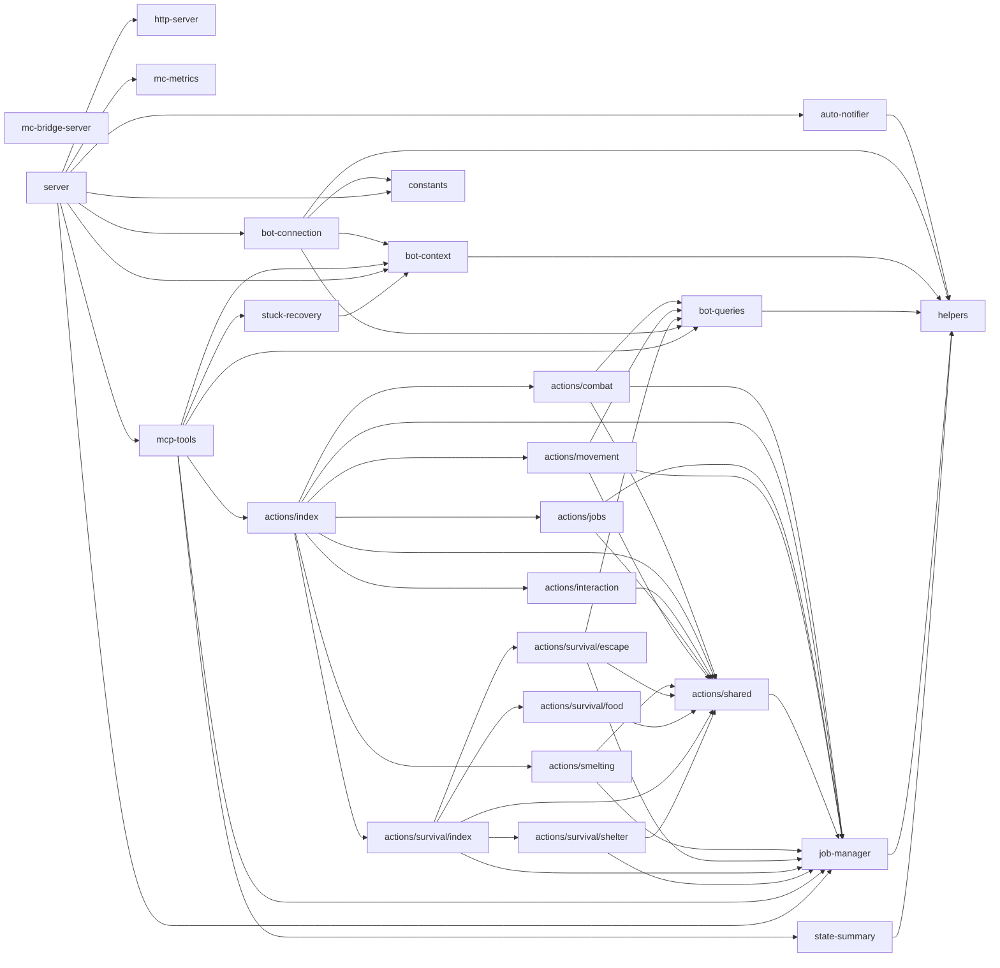

# minecraft/ 依存関係（自動生成）

> commit 時に自動再生成。手動編集禁止。

## ファイル依存関係図

## ファイル別依存一覧

### actions/combat.ts

- モジュール内依存: actions/shared, bot-queries, job-manager
- 外部依存: ../../../node_modules/.bun/mineflayer-pathfinder@2.4.5/node_modules/mineflayer-pathfinder/index.js, ../../../node_modules/.bun/mineflayer@4.35.0/node_modules/mineflayer/index.js, ../../../node_modules/.bun/zod@4.3.6/node_modules/zod/index.cjs, @modelcontextprotocol/sdk/server/mcp.js, prismarine-entity

### actions/index.ts

- モジュール内依存: actions/combat, actions/interaction, actions/jobs, actions/movement, actions/shared, actions/smelting, actions/survival/index, job-manager
- 他モジュール依存: shared
- 外部依存: @modelcontextprotocol/sdk/server/mcp.js

### actions/interaction.ts

- モジュール内依存: actions/shared
- 外部依存: ../../../node_modules/.bun/mineflayer@4.35.0/node_modules/mineflayer/index.js, ../../../node_modules/.bun/zod@4.3.6/node_modules/zod/index.cjs, @modelcontextprotocol/sdk/server/mcp.js, vec3

### actions/jobs.ts

- モジュール内依存: actions/shared, job-manager
- 他モジュール依存: shared
- 外部依存: ../../../node_modules/.bun/mineflayer-pathfinder@2.4.5/node_modules/mineflayer-pathfinder/index.js, ../../../node_modules/.bun/mineflayer@4.35.0/node_modules/mineflayer/index.js, ../../../node_modules/.bun/zod@4.3.6/node_modules/zod/index.cjs, @modelcontextprotocol/sdk/server/mcp.js, prismarine-recipe

### actions/movement.ts

- モジュール内依存: actions/shared, bot-queries, job-manager
- 外部依存: ../../../node_modules/.bun/mineflayer-pathfinder@2.4.5/node_modules/mineflayer-pathfinder/index.js, ../../../node_modules/.bun/mineflayer@4.35.0/node_modules/mineflayer/index.js, ../../../node_modules/.bun/zod@4.3.6/node_modules/zod/index.cjs, @modelcontextprotocol/sdk/server/mcp.js, prismarine-entity

### actions/shared.ts

- モジュール内依存: job-manager
- 外部依存: ../../../node_modules/.bun/mineflayer-pathfinder@2.4.5/node_modules/mineflayer-pathfinder/index.js, ../../../node_modules/.bun/mineflayer@4.35.0/node_modules/mineflayer/index.js

### actions/smelting.ts

- モジュール内依存: actions/shared, job-manager
- 外部依存: ../../../node_modules/.bun/mineflayer-pathfinder@2.4.5/node_modules/mineflayer-pathfinder/index.js, ../../../node_modules/.bun/mineflayer@4.35.0/node_modules/mineflayer/index.js, ../../../node_modules/.bun/zod@4.3.6/node_modules/zod/index.cjs, @modelcontextprotocol/sdk/server/mcp.js

### actions/survival/escape.ts

- モジュール内依存: actions/shared, bot-queries, job-manager
- 外部依存: ../../../node_modules/.bun/mineflayer-pathfinder@2.4.5/node_modules/mineflayer-pathfinder/index.js, ../../../node_modules/.bun/zod@4.3.6/node_modules/zod/index.cjs, @modelcontextprotocol/sdk/server/mcp.js

### actions/survival/food.ts

- モジュール内依存: actions/shared
- 外部依存: ../../../node_modules/.bun/mineflayer@4.35.0/node_modules/mineflayer/index.js, ../../../node_modules/.bun/zod@4.3.6/node_modules/zod/index.cjs, @modelcontextprotocol/sdk/server/mcp.js

### actions/survival/index.ts

- モジュール内依存: actions/shared, actions/survival/escape, actions/survival/food, actions/survival/shelter, job-manager
- 外部依存: @modelcontextprotocol/sdk/server/mcp.js

### actions/survival/shelter.ts

- モジュール内依存: actions/shared, job-manager
- 外部依存: ../../../node_modules/.bun/mineflayer-pathfinder@2.4.5/node_modules/mineflayer-pathfinder/index.js, ../../../node_modules/.bun/mineflayer@4.35.0/node_modules/mineflayer/index.js, ../../../node_modules/.bun/zod@4.3.6/node_modules/zod/index.cjs, @modelcontextprotocol/sdk/server/mcp.js, vec3

### auto-notifier.ts

- モジュール内依存: helpers
- 他モジュール依存: observability, shared, store

### bot-connection.ts

- モジュール内依存: bot-context, bot-queries, constants, helpers
- 他モジュール依存: shared
- 外部依存: ../../../node_modules/.bun/mineflayer-pathfinder@2.4.5/node_modules/mineflayer-pathfinder/index.js, ../../../node_modules/.bun/mineflayer@4.35.0/node_modules/mineflayer/index.js, ../../../node_modules/.bun/prismarine-viewer@1.33.0/node_modules/prismarine-viewer/index.js, prismarine-entity

### bot-context.ts

- モジュール内依存: helpers
- 他モジュール依存: observability, shared
- 外部依存: ../../../node_modules/.bun/mineflayer@4.35.0/node_modules/mineflayer/index.js

### bot-queries.ts

- モジュール内依存: helpers
- 外部依存: ../../../node_modules/.bun/mineflayer@4.35.0/node_modules/mineflayer/index.js, prismarine-entity, vec3

### constants.ts

- 外部依存: ../../../node_modules/.bun/zod@4.3.6/node_modules/zod/index.cjs

### helpers.ts

- 依存なし

### http-server.ts

- 他モジュール依存: mcp

### job-manager.ts

- モジュール内依存: helpers
- 他モジュール依存: observability, shared

### mc-bridge-server.ts

- 他モジュール依存: mcp, shared, store
- 外部依存: @modelcontextprotocol/sdk/server/mcp.js, @modelcontextprotocol/sdk/server/stdio.js, path

### mc-metrics.ts

- 他モジュール依存: observability, shared

### mcp-tools.ts

- モジュール内依存: actions/index, bot-context, bot-queries, job-manager, state-summary, stuck-recovery
- 他モジュール依存: observability, shared
- 外部依存: ../../../node_modules/.bun/zod@4.3.6/node_modules/zod/index.cjs, @modelcontextprotocol/sdk/server/mcp.js

### server.ts

- モジュール内依存: auto-notifier, bot-connection, bot-context, constants, http-server, job-manager, mc-metrics, mcp-tools
- 他モジュール依存: observability, store
- 外部依存: @modelcontextprotocol/sdk/server/mcp.js

### state-summary.ts

- モジュール内依存: helpers

### stuck-recovery.ts

- モジュール内依存: bot-context
