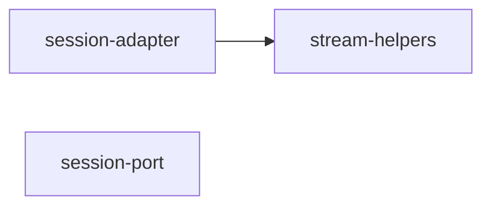

# opencode/ 依存関係（自動生成）

> commit 時に自動再生成。手動編集禁止。

## ファイル依存関係図

## ファイル別依存一覧

### session-adapter.ts

- モジュール内依存: stream-helpers
- 他モジュール依存: shared
- 外部依存: @opencode-ai/sdk/v2

### session-port.ts

- 他モジュール依存: shared

### stream-helpers.ts

- 他モジュール依存: shared
- 外部依存: @opencode-ai/sdk/v2
