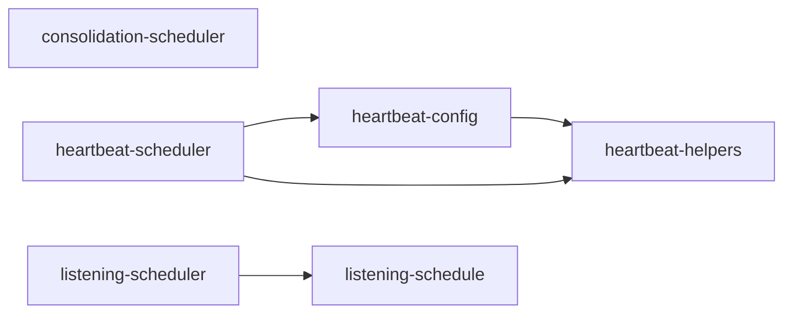

# scheduling/ 依存関係（自動生成）

> commit 時に自動再生成。手動編集禁止。

## ファイル依存関係図

## ファイル別依存一覧

### consolidation-scheduler.ts

- 他モジュール依存: observability, shared

### heartbeat-config.ts

- モジュール内依存: heartbeat-helpers
- 他モジュール依存: shared
- 外部依存: ../../../node_modules/.bun/zod@4.3.6/node_modules/zod/index.cjs, fs, path

### heartbeat-helpers.ts

- 他モジュール依存: shared

### heartbeat-scheduler.ts

- モジュール内依存: heartbeat-config, heartbeat-helpers
- 他モジュール依存: application, observability, shared
- 外部依存: path

### listening-schedule.ts

- 依存なし

### listening-scheduler.ts

- モジュール内依存: listening-schedule
- 他モジュール依存: observability, shared
