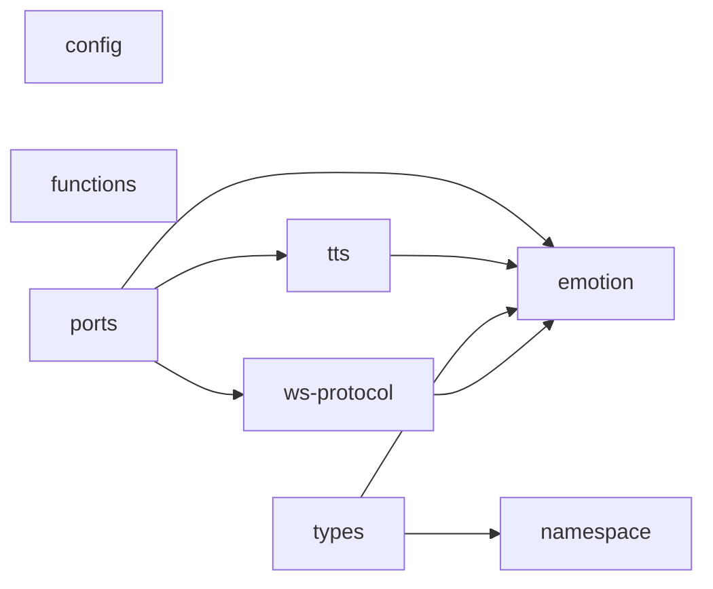

# shared/ 依存関係（自動生成）

> commit 時に自動再生成。手動編集禁止。

## ファイル依存関係図

## ファイル別依存一覧

### config.ts

- 外部依存: path

### emotion.ts

- 外部依存: ../../../node_modules/.bun/zod@4.3.6/node_modules/zod/index.cjs

### functions.ts

- 依存なし

### namespace.ts

- 外部依存: path

### ports.ts

- モジュール内依存: emotion, tts, ws-protocol

### tts.ts

- モジュール内依存: emotion
- 外部依存: ../../../node_modules/.bun/zod@4.3.6/node_modules/zod/index.cjs

### types.ts

- モジュール内依存: emotion, namespace

### ws-protocol.ts

- モジュール内依存: emotion
- 外部依存: ../../../node_modules/.bun/zod@4.3.6/node_modules/zod/index.cjs
