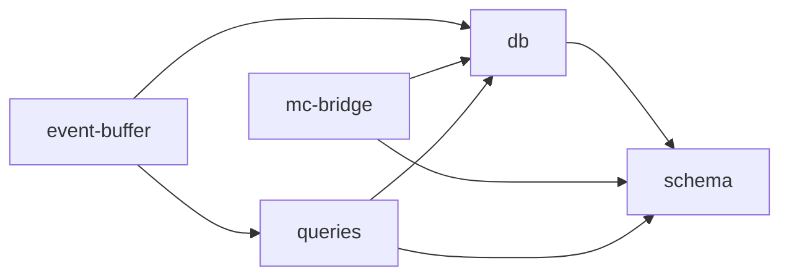

# store/ 依存関係（自動生成）

> commit 時に自動再生成。手動編集禁止。

## ファイル依存関係図

## ファイル別依存一覧

### db.ts

- モジュール内依存: schema
- 外部依存: .bun, bun:sqlite, fs, path

### event-buffer.ts

- モジュール内依存: db, queries
- 他モジュール依存: shared

### mc-bridge.ts

- モジュール内依存: db, schema
- 外部依存: .bun

### queries.ts

- モジュール内依存: db, schema
- 外部依存: .bun

### schema.ts

- 外部依存: .bun
