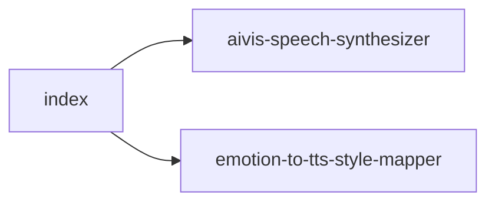

# tts/ 依存関係（自動生成）

> commit 時に自動再生成。手動編集禁止。

## ファイル依存関係図

## ファイル別依存一覧

### aivis-speech-synthesizer.ts

- 他モジュール依存: shared

### emotion-to-tts-style-mapper.ts

- 他モジュール依存: shared

### index.ts

- モジュール内依存: aivis-speech-synthesizer, emotion-to-tts-style-mapper
