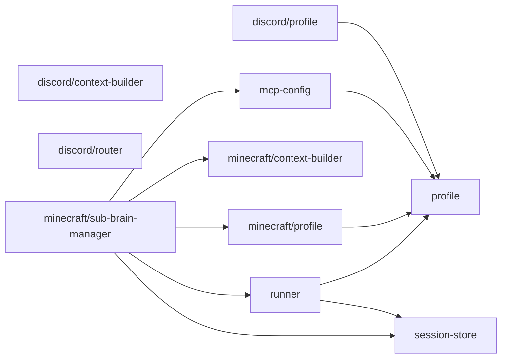

# agent/ 依存関係（自動生成）

> `nr deps:graph` で再生成。手動編集禁止。

## ファイル依存関係図

## ファイル別依存一覧

### discord/context-builder.ts

- 他モジュール依存: core/
- 外部依存: path

### discord/profile.ts

- モジュール内依存: profile
- 他モジュール依存: core/

### discord/router.ts

- 他モジュール依存: core/

### mcp-config.ts

- モジュール内依存: profile
- 外部依存: path

### minecraft/context-builder.ts

- 他モジュール依存: core/
- 外部依存: path

### minecraft/profile.ts

- モジュール内依存: profile
- 他モジュール依存: core/

### minecraft/sub-brain-manager.ts

- モジュール内依存: mcp-config, minecraft/context-builder, minecraft/profile, runner, session-store
- 他モジュール依存: core/, store/
- 外部依存: path

### profile.ts

- 依存なし

### runner.ts

- モジュール内依存: profile, session-store
- 他モジュール依存: core/

### session-store.ts

- 他モジュール依存: store/
- 外部依存: drizzle-orm
