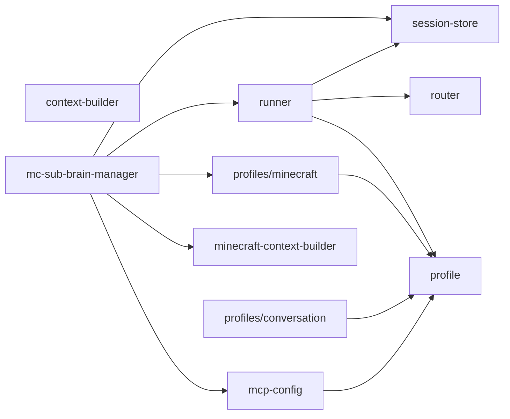

# agent/ 依存関係（自動生成）

> `nr deps:graph` で再生成。手動編集禁止。

## ファイル依存関係図

## ファイル別依存一覧

### context-builder.ts

- 他モジュール依存: core/
- 外部依存: path

### mc-sub-brain-manager.ts

- モジュール内依存: mcp-config, minecraft-context-builder, profiles/minecraft, runner, session-store
- 他モジュール依存: core/, store/
- 外部依存: path

### mcp-config.ts

- モジュール内依存: profile
- 外部依存: path

### minecraft-context-builder.ts

- 他モジュール依存: core/
- 外部依存: path

### profile.ts

- 依存なし

### profiles/conversation.ts

- モジュール内依存: profile
- 他モジュール依存: core/

### profiles/minecraft.ts

- モジュール内依存: profile
- 他モジュール依存: core/

### router.ts

- 他モジュール依存: core/

### runner.ts

- モジュール内依存: profile, router, session-store
- 他モジュール依存: core/

### session-store.ts

- 他モジュール依存: store/
- 外部依存: drizzle-orm
