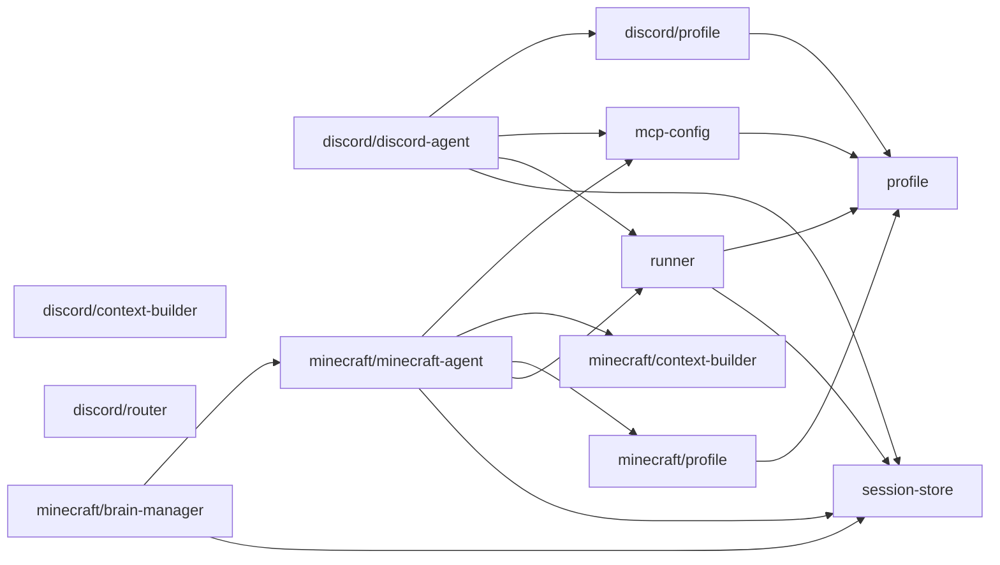

# agent/ 依存関係（自動生成）

> commit 時に自動再生成。手動編集禁止。

## ファイル依存関係図

## ファイル別依存一覧

### discord/context-builder.ts

- 外部依存: @vicissitude/shared/types, path

### discord/discord-agent.ts

- モジュール内依存: discord/profile, mcp-config, runner, session-store
- 他モジュール依存: opencode/, store/
- 外部依存: @vicissitude/shared/types

### discord/profile.ts

- モジュール内依存: profile
- 外部依存: @vicissitude/shared/constants

### discord/router.ts

- 外部依存: @vicissitude/shared/types

### mcp-config.ts

- モジュール内依存: profile
- 外部依存: path

### minecraft/brain-manager.ts

- モジュール内依存: minecraft/minecraft-agent, session-store
- 他モジュール依存: store/
- 外部依存: @vicissitude/shared/constants, @vicissitude/shared/types

### minecraft/context-builder.ts

- 外部依存: @vicissitude/shared/types, path

### minecraft/minecraft-agent.ts

- モジュール内依存: mcp-config, minecraft/context-builder, minecraft/profile, runner, session-store
- 他モジュール依存: opencode/
- 外部依存: @vicissitude/shared/constants, @vicissitude/shared/types, path

### minecraft/profile.ts

- モジュール内依存: profile
- 外部依存: @vicissitude/shared/constants

### profile.ts

- 依存なし

### runner.ts

- モジュール内依存: profile, session-store
- 外部依存: @vicissitude/shared/functions, @vicissitude/shared/types

### session-store.ts

- 他モジュール依存: store/
- 外部依存: .bun
