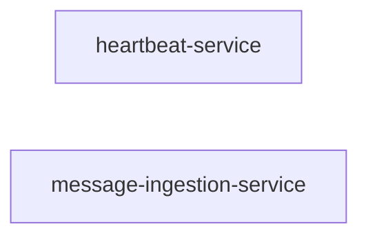

# application/ 依存関係（自動生成）

> commit 時に自動再生成。手動編集禁止。

## ファイル依存関係図

```mermaid
graph LR
  heartbeat_service["heartbeat-service"]
  message_ingestion_service["message-ingestion-service"]
```

## ファイル別依存一覧

### heartbeat-service.ts
- 他モジュール依存: core/

### message-ingestion-service.ts
- 他モジュール依存: core/
