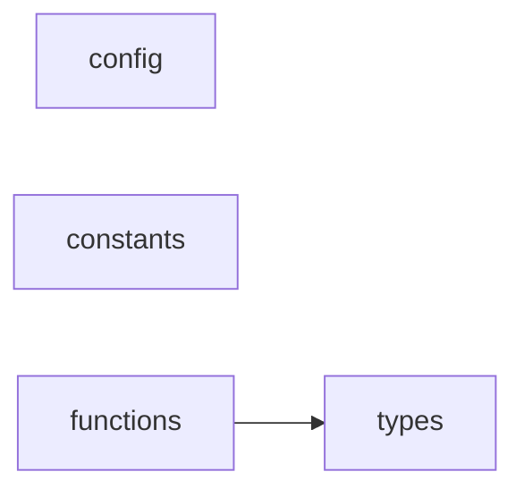

# core/ 依存関係（自動生成）

> `nr deps:graph` で再生成。手動編集禁止。

## ファイル依存関係図

## ファイル別依存一覧

### config.ts

- 外部依存: path, zod

### constants.ts

- 依存なし

### functions.ts

- モジュール内依存: types

### types.ts

- 依存なし
