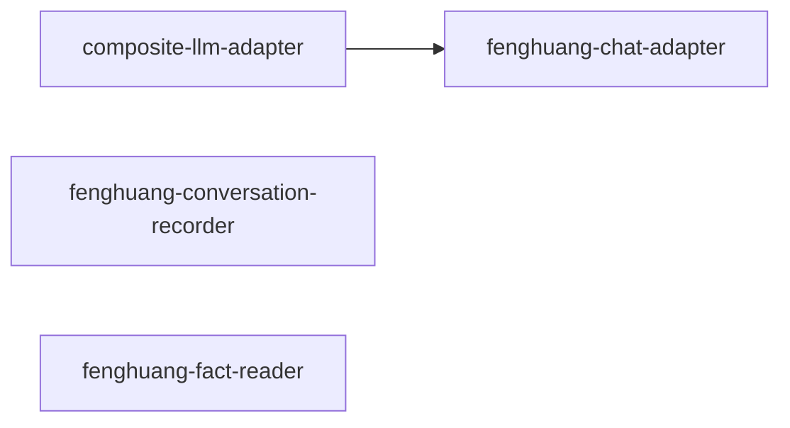

# fenghuang/ 依存関係（自動生成）

> commit 時に自動再生成。手動編集禁止。

## ファイル依存関係図

## ファイル別依存一覧

### composite-llm-adapter.ts

- モジュール内依存: fenghuang-chat-adapter
- 他モジュール依存: ollama/
- 外部依存: fenghuang

### fenghuang-chat-adapter.ts

- 他モジュール依存: core/
- 外部依存: fenghuang

### fenghuang-conversation-recorder.ts

- 他モジュール依存: core/
- 外部依存: fenghuang, fs, path

### fenghuang-fact-reader.ts

- 他モジュール依存: core/
- 外部依存: fenghuang, fs, path
