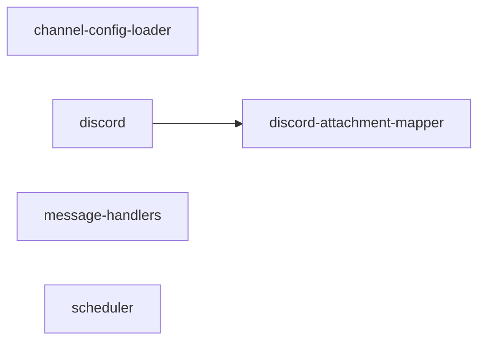

# gateway/ 依存関係（自動生成）

> commit 時に自動再生成。手動編集禁止。

## ファイル依存関係図

## ファイル別依存一覧

### channel-config-loader.ts

- 依存なし

### discord.ts

- モジュール内依存: discord-attachment-mapper
- 他モジュール依存: core/
- 外部依存: discord.js

### discord-attachment-mapper.ts

- 他モジュール依存: core/
- 外部依存: discord.js

### message-handlers.ts

- 他モジュール依存: core/, store/

### scheduler.ts

- 他モジュール依存: scheduling/
