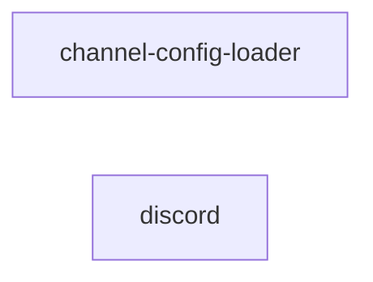

# gateway/ 依存関係（自動生成）

> commit 時に自動再生成。手動編集禁止。

## ファイル依存関係図

## ファイル別依存一覧

### channel-config-loader.ts

- 依存なし

### discord.ts

- 外部依存: .bun, @vicissitude/infrastructure/discord/attachment-mapper, @vicissitude/infrastructure/discord/url-rewriter, @vicissitude/shared/types
