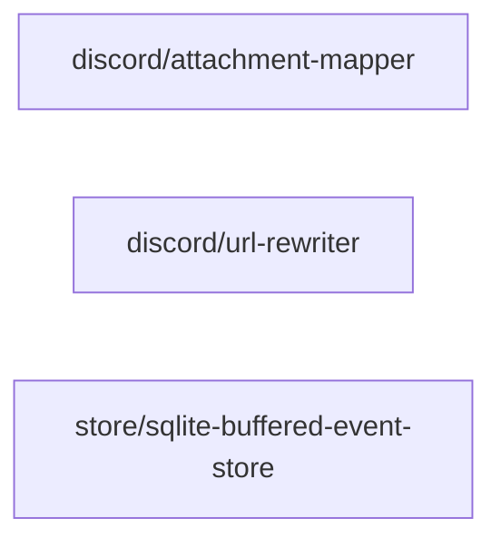

# infrastructure/ 依存関係（自動生成）

> commit 時に自動再生成。手動編集禁止。

## ファイル依存関係図

## ファイル別依存一覧

### discord/attachment-mapper.ts

- 他モジュール依存: core/
- 外部依存: discord.js

### discord/url-rewriter.ts

- 依存なし

### store/sqlite-buffered-event-store.ts

- 他モジュール依存: application/, core/, store/
