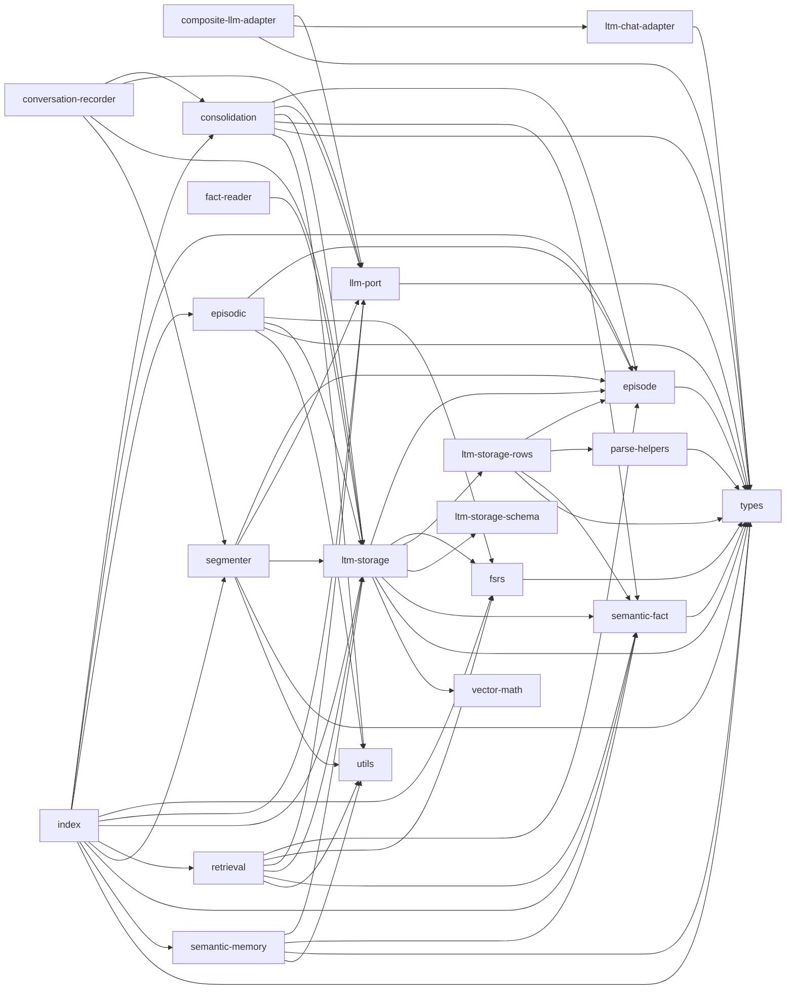

# ltm/ 依存関係（自動生成）

> commit 時に自動再生成。手動編集禁止。

## ファイル依存関係図

## ファイル別依存一覧

### composite-llm-adapter.ts

- モジュール内依存: llm-port, ltm-chat-adapter, types
- 他モジュール依存: ollama/

### consolidation.ts

- モジュール内依存: episode, llm-port, ltm-storage, semantic-fact, types, utils

### conversation-recorder.ts

- モジュール内依存: consolidation, llm-port, ltm-storage, segmenter
- 他モジュール依存: core/
- 外部依存: fs, path

### episode.ts

- モジュール内依存: types

### episodic.ts

- モジュール内依存: episode, fsrs, ltm-storage, types, utils

### fact-reader.ts

- モジュール内依存: ltm-storage
- 他モジュール依存: core/
- 外部依存: fs, path

### fsrs.ts

- モジュール内依存: types

### index.ts

- モジュール内依存: consolidation, episode, episodic, fsrs, llm-port, ltm-storage, retrieval, segmenter, semantic-fact, semantic-memory, types

### llm-port.ts

- モジュール内依存: types

### ltm-chat-adapter.ts

- モジュール内依存: types
- 他モジュール依存: core/

### ltm-storage.ts

- モジュール内依存: episode, fsrs, ltm-storage-rows, ltm-storage-schema, semantic-fact, types, vector-math
- 外部依存: bun:sqlite

### ltm-storage-rows.ts

- モジュール内依存: episode, parse-helpers, semantic-fact, types

### ltm-storage-schema.ts

- 外部依存: bun:sqlite

### parse-helpers.ts

- モジュール内依存: types

### retrieval.ts

- モジュール内依存: episode, fsrs, llm-port, ltm-storage, semantic-fact, utils

### segmenter.ts

- モジュール内依存: episode, llm-port, ltm-storage, types, utils

### semantic-fact.ts

- モジュール内依存: types

### semantic-memory.ts

- モジュール内依存: ltm-storage, semantic-fact, types, utils

### types.ts

- 依存なし

### utils.ts

- 依存なし

### vector-math.ts

- 依存なし
