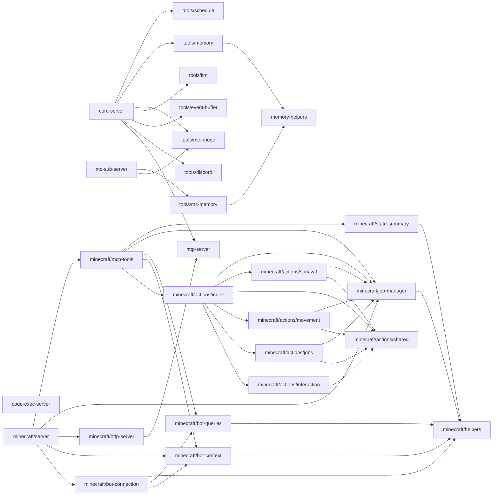

# mcp/ 依存関係（自動生成）

> commit 時に自動再生成。手動編集禁止。

## ファイル依存関係図

## ファイル別依存一覧

### code-exec-server.ts

- 外部依存: @modelcontextprotocol/sdk/server/mcp.js, @modelcontextprotocol/sdk/server/stdio.js, zod

### core-server.ts

- モジュール内依存: http-server, tools/discord, tools/event-buffer, tools/ltm, tools/mc-bridge, tools/memory, tools/schedule
- 他モジュール依存: core/, fenghuang/, ollama/, opencode/, store/
- 外部依存: @modelcontextprotocol/sdk/server/mcp.js, discord.js, fenghuang, fs, path

### http-server.ts

- 外部依存: @modelcontextprotocol/sdk/server/mcp.js, @modelcontextprotocol/sdk/server/webStandardStreamableHttp.js

### mc-sub-server.ts

- モジュール内依存: tools/mc-bridge, tools/mc-memory
- 他モジュール依存: store/
- 外部依存: @modelcontextprotocol/sdk/server/mcp.js, @modelcontextprotocol/sdk/server/stdio.js, path

### memory-helpers.ts

- 外部依存: fs, path, zod

### minecraft/actions/index.ts

- モジュール内依存: minecraft/actions/interaction, minecraft/actions/jobs, minecraft/actions/movement, minecraft/actions/shared, minecraft/actions/survival, minecraft/job-manager
- 外部依存: @modelcontextprotocol/sdk/server/mcp.js

### minecraft/actions/interaction.ts

- モジュール内依存: minecraft/actions/shared
- 外部依存: @modelcontextprotocol/sdk/server/mcp.js, mineflayer, vec3, zod

### minecraft/actions/jobs.ts

- モジュール内依存: minecraft/actions/shared, minecraft/job-manager
- 外部依存: @modelcontextprotocol/sdk/server/mcp.js, mineflayer, mineflayer-pathfinder, prismarine-recipe, zod

### minecraft/actions/movement.ts

- モジュール内依存: minecraft/actions/shared, minecraft/job-manager
- 外部依存: @modelcontextprotocol/sdk/server/mcp.js, mineflayer, mineflayer-pathfinder, prismarine-entity, zod

### minecraft/actions/shared.ts

- 外部依存: mineflayer, mineflayer-pathfinder

### minecraft/actions/survival.ts

- モジュール内依存: minecraft/actions/shared, minecraft/job-manager
- 外部依存: @modelcontextprotocol/sdk/server/mcp.js, mineflayer, mineflayer-pathfinder, vec3, zod

### minecraft/bot-connection.ts

- モジュール内依存: minecraft/bot-context, minecraft/bot-queries, minecraft/helpers
- 外部依存: mineflayer, mineflayer-pathfinder, prismarine-entity, prismarine-viewer

### minecraft/bot-context.ts

- モジュール内依存: minecraft/helpers
- 外部依存: mineflayer

### minecraft/bot-queries.ts

- モジュール内依存: minecraft/helpers
- 外部依存: mineflayer

### minecraft/helpers.ts

- 依存なし

### minecraft/http-server.ts

- モジュール内依存: http-server

### minecraft/job-manager.ts

- モジュール内依存: minecraft/helpers

### minecraft/mcp-tools.ts

- モジュール内依存: minecraft/actions/index, minecraft/bot-context, minecraft/bot-queries, minecraft/job-manager, minecraft/state-summary
- 外部依存: @modelcontextprotocol/sdk/server/mcp.js, zod

### minecraft/server.ts

- モジュール内依存: minecraft/bot-connection, minecraft/bot-context, minecraft/http-server, minecraft/job-manager, minecraft/mcp-tools
- 外部依存: @modelcontextprotocol/sdk/server/mcp.js

### minecraft/state-summary.ts

- モジュール内依存: minecraft/helpers

### tools/discord.ts

- 他モジュール依存: gateway/
- 外部依存: @modelcontextprotocol/sdk/server/mcp.js, discord.js, fs, path, zod

### tools/event-buffer.ts

- 他モジュール依存: store/
- 外部依存: @modelcontextprotocol/sdk/server/mcp.js, zod

### tools/ltm.ts

- 外部依存: @modelcontextprotocol/sdk/server/mcp.js, fenghuang, zod

### tools/mc-bridge.ts

- 他モジュール依存: store/
- 外部依存: @modelcontextprotocol/sdk/server/mcp.js, zod

### tools/mc-memory.ts

- モジュール内依存: memory-helpers
- 外部依存: @modelcontextprotocol/sdk/server/mcp.js, fs, path, zod

### tools/memory.ts

- モジュール内依存: memory-helpers
- 外部依存: @modelcontextprotocol/sdk/server/mcp.js, fs, path, zod

### tools/schedule.ts

- 他モジュール依存: core/
- 外部依存: @modelcontextprotocol/sdk/server/mcp.js, fs, path, zod
