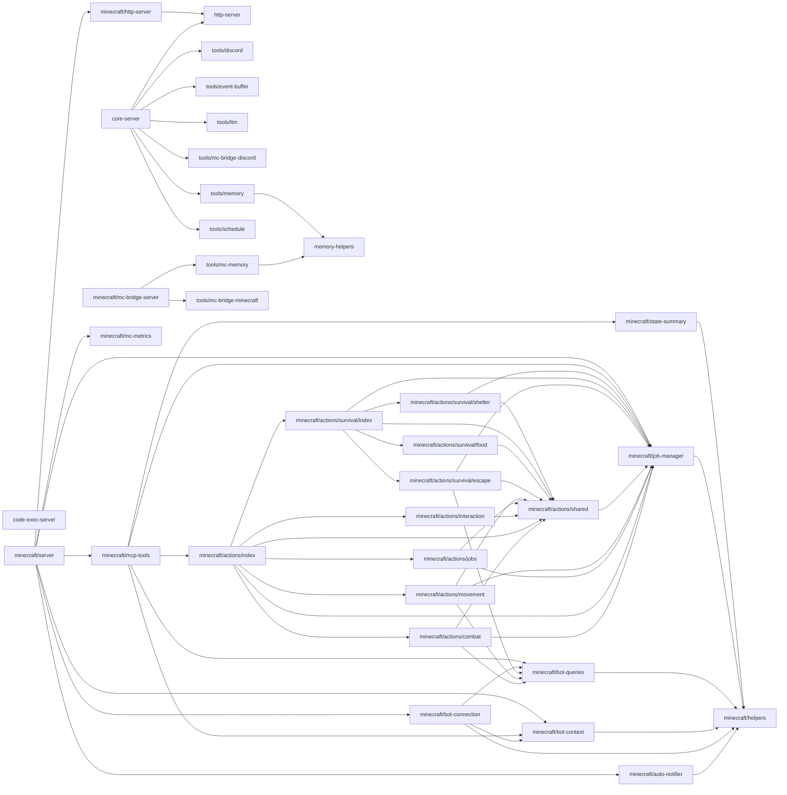

# mcp/ 依存関係（自動生成）

> commit 時に自動再生成。手動編集禁止。

## ファイル依存関係図

## ファイル別依存一覧

### code-exec-server.ts

- 外部依存: .bun, @modelcontextprotocol/sdk/server/mcp.js, @modelcontextprotocol/sdk/server/stdio.js

### core-server.ts

- モジュール内依存: http-server, tools/discord, tools/event-buffer, tools/ltm, tools/mc-bridge-discord, tools/memory, tools/schedule
- 外部依存: .bun, @modelcontextprotocol/sdk/server/mcp.js, @vicissitude/ltm/episodic, @vicissitude/ltm/llm-port, @vicissitude/ltm/ltm-storage, @vicissitude/ltm/retrieval, @vicissitude/ltm/semantic-memory, @vicissitude/ollama, @vicissitude/store/db, fs, path

### http-server.ts

- 外部依存: @modelcontextprotocol/sdk/server/mcp.js, @modelcontextprotocol/sdk/server/webStandardStreamableHttp.js

### memory-helpers.ts

- 外部依存: .bun, fs, path

### minecraft/actions/combat.ts

- モジュール内依存: minecraft/actions/shared, minecraft/bot-queries, minecraft/job-manager
- 外部依存: .bun, @modelcontextprotocol/sdk/server/mcp.js, prismarine-entity

### minecraft/actions/index.ts

- モジュール内依存: minecraft/actions/combat, minecraft/actions/interaction, minecraft/actions/jobs, minecraft/actions/movement, minecraft/actions/shared, minecraft/actions/survival/index, minecraft/job-manager
- 外部依存: @modelcontextprotocol/sdk/server/mcp.js

### minecraft/actions/interaction.ts

- モジュール内依存: minecraft/actions/shared
- 外部依存: .bun, @modelcontextprotocol/sdk/server/mcp.js, vec3

### minecraft/actions/jobs.ts

- モジュール内依存: minecraft/actions/shared, minecraft/job-manager
- 外部依存: .bun, @modelcontextprotocol/sdk/server/mcp.js, prismarine-recipe

### minecraft/actions/movement.ts

- モジュール内依存: minecraft/actions/shared, minecraft/bot-queries, minecraft/job-manager
- 外部依存: .bun, @modelcontextprotocol/sdk/server/mcp.js, prismarine-entity

### minecraft/actions/shared.ts

- モジュール内依存: minecraft/job-manager
- 外部依存: .bun

### minecraft/actions/survival/escape.ts

- モジュール内依存: minecraft/actions/shared, minecraft/bot-queries, minecraft/job-manager
- 外部依存: .bun, @modelcontextprotocol/sdk/server/mcp.js

### minecraft/actions/survival/food.ts

- モジュール内依存: minecraft/actions/shared
- 外部依存: .bun, @modelcontextprotocol/sdk/server/mcp.js

### minecraft/actions/survival/index.ts

- モジュール内依存: minecraft/actions/shared, minecraft/actions/survival/escape, minecraft/actions/survival/food, minecraft/actions/survival/shelter, minecraft/job-manager
- 外部依存: @modelcontextprotocol/sdk/server/mcp.js

### minecraft/actions/survival/shelter.ts

- モジュール内依存: minecraft/actions/shared, minecraft/job-manager
- 外部依存: .bun, @modelcontextprotocol/sdk/server/mcp.js, vec3

### minecraft/auto-notifier.ts

- モジュール内依存: minecraft/helpers
- 外部依存: @vicissitude/shared/constants, @vicissitude/shared/types, @vicissitude/store/db, @vicissitude/store/mc-bridge, @vicissitude/store/queries

### minecraft/bot-connection.ts

- モジュール内依存: minecraft/bot-context, minecraft/bot-queries, minecraft/helpers
- 外部依存: .bun, @vicissitude/shared/config, prismarine-entity

### minecraft/bot-context.ts

- モジュール内依存: minecraft/helpers
- 外部依存: .bun, @vicissitude/shared/constants, @vicissitude/shared/types

### minecraft/bot-queries.ts

- モジュール内依存: minecraft/helpers
- 外部依存: .bun, prismarine-entity, vec3

### minecraft/helpers.ts

- 依存なし

### minecraft/http-server.ts

- モジュール内依存: http-server

### minecraft/job-manager.ts

- モジュール内依存: minecraft/helpers
- 外部依存: @vicissitude/shared/constants, @vicissitude/shared/types

### minecraft/mc-bridge-server.ts

- モジュール内依存: tools/mc-bridge-minecraft, tools/mc-memory
- 外部依存: @modelcontextprotocol/sdk/server/mcp.js, @modelcontextprotocol/sdk/server/stdio.js, @vicissitude/store/db, path

### minecraft/mc-metrics.ts

- 外部依存: @vicissitude/shared/constants, @vicissitude/shared/functions, @vicissitude/shared/types

### minecraft/mcp-tools.ts

- モジュール内依存: minecraft/actions/index, minecraft/bot-context, minecraft/bot-queries, minecraft/job-manager, minecraft/state-summary
- 外部依存: .bun, @modelcontextprotocol/sdk/server/mcp.js, @vicissitude/shared/constants, @vicissitude/shared/types

### minecraft/server.ts

- モジュール内依存: minecraft/auto-notifier, minecraft/bot-connection, minecraft/bot-context, minecraft/http-server, minecraft/job-manager, minecraft/mc-metrics, minecraft/mcp-tools
- 外部依存: @modelcontextprotocol/sdk/server/mcp.js, @vicissitude/shared/config, @vicissitude/store/db

### minecraft/state-summary.ts

- モジュール内依存: minecraft/helpers

### tools/discord.ts

- 外部依存: .bun, @modelcontextprotocol/sdk/server/mcp.js, @vicissitude/infrastructure/discord/attachment-mapper, fs, path

### tools/event-buffer.ts

- 外部依存: .bun, @modelcontextprotocol/sdk/server/mcp.js, @vicissitude/store/db, @vicissitude/store/queries

### tools/ltm.ts

- 外部依存: .bun, @modelcontextprotocol/sdk/server/mcp.js, @vicissitude/ltm/retrieval, @vicissitude/ltm/semantic-fact, @vicissitude/ltm/semantic-memory

### tools/mc-bridge-discord.ts

- 外部依存: .bun, @modelcontextprotocol/sdk/server/mcp.js, @vicissitude/shared/constants, @vicissitude/store/db, @vicissitude/store/mc-bridge, @vicissitude/store/queries

### tools/mc-bridge-minecraft.ts

- 外部依存: .bun, @modelcontextprotocol/sdk/server/mcp.js, @vicissitude/store/db, @vicissitude/store/mc-bridge, @vicissitude/store/queries

### tools/mc-memory.ts

- モジュール内依存: memory-helpers
- 外部依存: .bun, @modelcontextprotocol/sdk/server/mcp.js, fs, path

### tools/memory.ts

- モジュール内依存: memory-helpers
- 外部依存: .bun, @modelcontextprotocol/sdk/server/mcp.js, fs, path

### tools/schedule.ts

- 外部依存: .bun, @modelcontextprotocol/sdk/server/mcp.js, @vicissitude/shared/config, @vicissitude/shared/functions, @vicissitude/shared/types, fs, path
