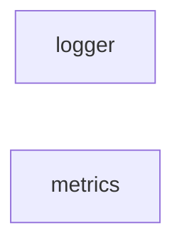

# observability/ 依存関係（自動生成）

> commit 時に自動再生成。手動編集禁止。

## ファイル依存関係図

## ファイル別依存一覧

### logger.ts

- 外部依存: @vicissitude/shared/types

### metrics.ts

- 外部依存: @vicissitude/shared/constants, @vicissitude/shared/functions, @vicissitude/shared/types
