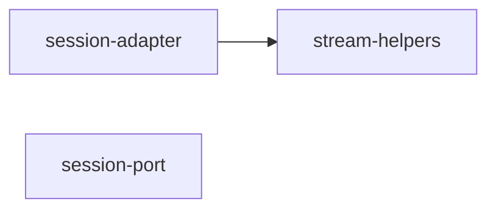

# opencode/ 依存関係（自動生成）

> commit 時に自動再生成。手動編集禁止。

## ファイル依存関係図

## ファイル別依存一覧

### session-adapter.ts

- モジュール内依存: stream-helpers
- 外部依存: @opencode-ai/sdk/v2, @vicissitude/shared/types

### session-port.ts

- 外部依存: @vicissitude/shared/types

### stream-helpers.ts

- 外部依存: @opencode-ai/sdk/v2, @vicissitude/shared/functions, @vicissitude/shared/types
