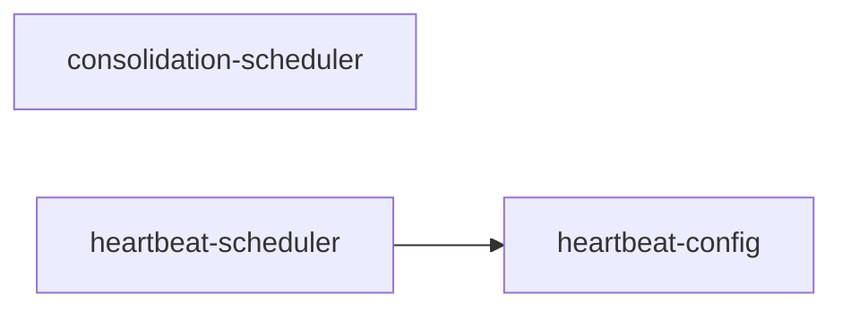

# scheduling/ 依存関係（自動生成）

> `nr deps:graph` で再生成。手動編集禁止。

## ファイル依存関係図

## ファイル別依存一覧

### consolidation-scheduler.ts

- 他モジュール依存: core/, observability/

### heartbeat-config.ts

- 他モジュール依存: core/
- 外部依存: fs, path, zod

### heartbeat-scheduler.ts

- モジュール内依存: heartbeat-config
- 他モジュール依存: core/, observability/
- 外部依存: path
