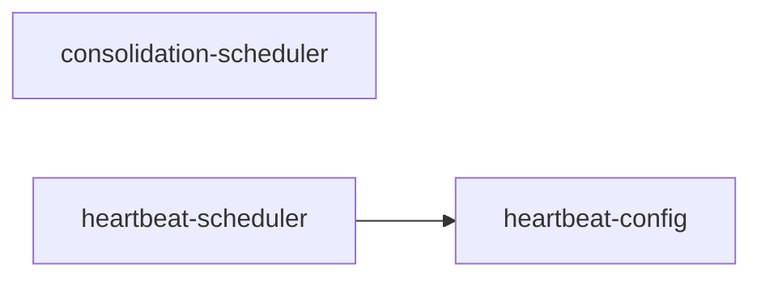

# scheduling/ 依存関係（自動生成）

> commit 時に自動再生成。手動編集禁止。

## ファイル依存関係図

## ファイル別依存一覧

### consolidation-scheduler.ts

- 他モジュール依存: observability/
- 外部依存: @vicissitude/shared/functions, @vicissitude/shared/types

### heartbeat-config.ts

- 外部依存: .bun, @vicissitude/shared/functions, @vicissitude/shared/types, fs, path

### heartbeat-scheduler.ts

- モジュール内依存: heartbeat-config
- 他モジュール依存: application/, observability/
- 外部依存: @vicissitude/shared/config, @vicissitude/shared/functions, @vicissitude/shared/types, path
